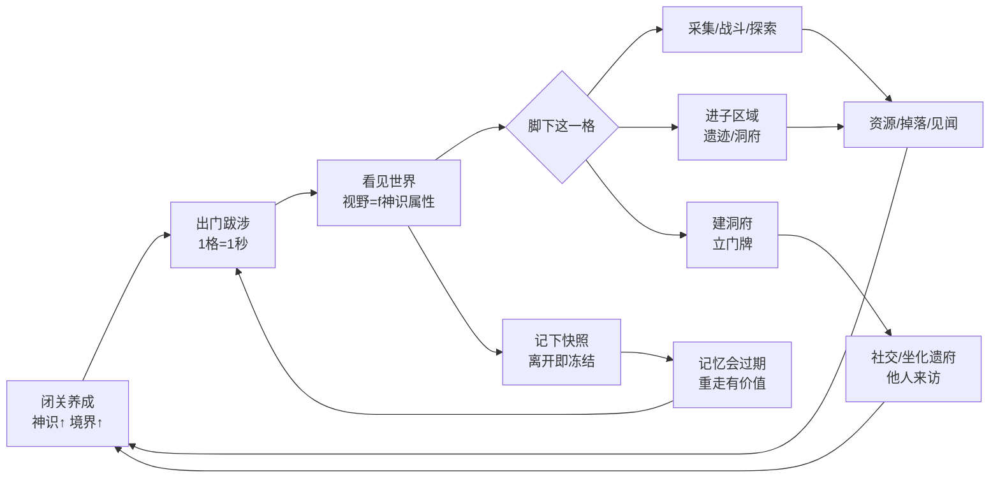
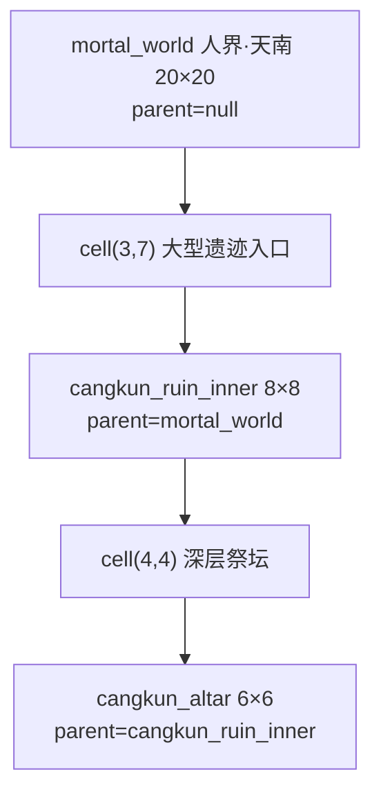
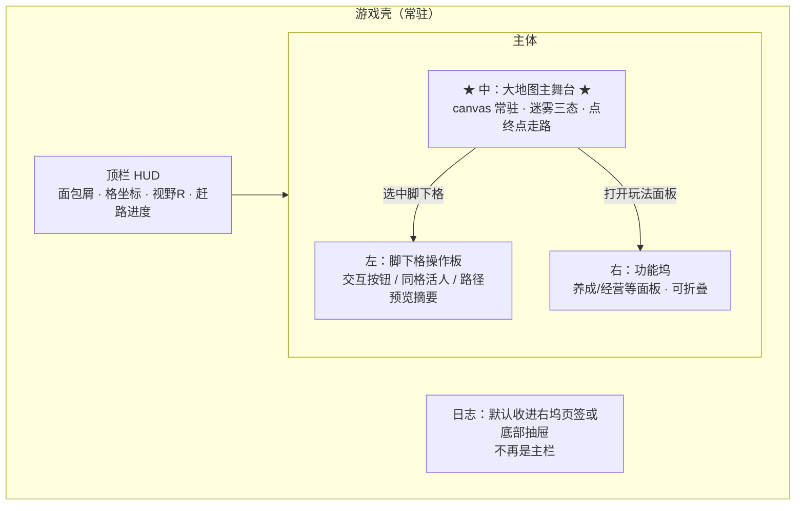

# 大地图格子化设计方案

> 范围：将现有「节点图式大地图」改造为「可嵌套网格区域」的完整设计，含视野/迷雾模型、格子内容规则、区域扩展机制、核心循环、配置与数据表设计
> 编写时间：2026-09-22（第 6 轮：补核心循环 / 玩法纵深 / 待决选项）；2026-09-23（第 7 轮：内容设计总表与真实配置）
> 状态：**主干、增强提案与内容总表均已定案**；配置文件已落盘 `server/config/grid_config.json` + `server/config/grid_poi_data.json`；仅剩数值微调与 Q5/Q15 可后置（§14.3）
> 关联代码：`server/config/grid_config.json`、`server/config/grid_poi_data.json`、`server/config/map_data.json`、`server/game/services/WorldMovementService.js`、`server/game/core/sensePool.js`、`server/models/playerMapPosition.js`、`server/models/playerCave.js`、`server/models/caveLegacy.js`、`client/src/components/panels/WorldMapPanel.vue`
> 关联文档：`docs/大地图行动为主_总体设计.md`（**体验与行动铁律总稿**，冲突时 L1–L6 优先）、`docs/openapi.json`（API 落地时需同步）、`docs/批次2_多人玩法设计方案.md`、`docs/批次3_设计文档.md`

**标注约定**（全文统一）：

| 标注 | 含义 |
|------|------|
| **【已定案】** | 你已拍板，落地时不得擅自改语义 |
| **【建议】** | 我推荐的默认值/做法，可改配置或改文档，不动架构 |
| **【待拍板】** | 仍开放；当前仅剩 §14.3 可后置项 |

---

## 〇、一页看懂

### 0.1 五句话版本

1. 世界是一张**可嵌套的格子地图**；大地图、遗迹内部、洞府内部都是同一种 `Region`。
2. 格子**不入库**，由 `(seed, x, y, 配置)` 确定性生成；手工锚点覆盖生成结果。
3. 迷雾是 **RTS 视线 + 快照冻结**：看得见是实时，离开后只留「你上次看见的样子」，背后世界继续变。
4. **只有脚下那一格能操作**（采集/建造/访问/进入）；路过不触发交互。
5. 移动统一公式：**耗时（秒） = 距离（格） × 1**；时间本身就是速率限制器。
6. **地图就是主界面**：打开即在图上，顶栏永远显示「我在哪」，脚下格即操作台（§9.0 / 行动铁律 L1–L6）。

### 0.2 核心循环（一图）



### 0.3 三层结构（一图）



> 迷雾、移动、探索进度、`WorldMapPanel` **共用一套实现**——子区域不是「另一个系统」。

### 0.4 阅读地图

| 想知道什么 | 去哪一节 |
|-----------|---------|
| 为什么改成格子 / 要解决什么 | §1 |
| Region / Cell / 坐标怎么定义 | §2 |
| 迷雾三态、快照冻结、神识视野 | §3 |
| 格子上有什么、踩上去会怎样 | §4 |
| 区域怎么变大变小、跨图怎么走 | §5 |
| 建洞府 / 坐化遗府闭环 | §6 |
| 配置 JSON / 新表结构 | §7 |
| 服务怎么拆、现有代码改哪 | §8 |
| 前端主舞台布局 / 四通道渲染 / LOD | §9 |
| API 草案 | §10 |
| 落地顺序 | §11 |
| 玩家从新手到后期怎么玩 | §12 |
| 移动预览 / 显影探查 / 世界事件 / 标记游记 / 聚落 | §13 |
| 全部决策一览（含仍开放项） | §14 |
| 内容总表：区域 / POI·地方志 / 内容池 / 新手区布局 | §15 |
| **行动铁律 / 全玩法地点化 / 作品验收** | `docs/大地图行动为主_总体设计.md` |

---

## 一、设计目标与现状问题

### 1.1 现状

当前大地图是一个**节点图**：8 个地图节点铺在 0~2000 的坐标面上，靠 `connections` 连成一条单链（1→2→3→4→5→6→7→8）。

```jsonc
// server/config/map_data.json（节选）
{
  "id": 1, "name": "越国", "type": "country",
  "x": 0, "y": 0,
  "resources": [ /* 3 条 */ ],
  "monsters":  [ /* 2 条 */ ],
  "connections": [2]
}
```

玩家位置是连续坐标（`pos_x` / `pos_y` DOUBLE），所属地图由"最近节点"决定。

### 1.2 已定位的痛点

| # | 问题 | 证据 / 后果 |
|---|------|------------|
| P1 | **地图中间是空的** | 8 个点 + 7 条线，点与点之间没有任何内容与反馈，玩家没有"世界感" |
| P2 | **境界门槛形同虚设** | `WorldMovementService.nearestMap()` 用最近节点判定归属；越国(0,0)→彩霞山(30,20) 仅距 36，而 `MAX_STEP = 80` 允许一次点击跨越极远距离。门槛实际靠"玩家敢不敢点过去"执行 |
| P3 | **探索相关字段全是死字段** | `visited_nodes` / `exploration_progress` / `resource_gather_count` 仅在 `routes/map.js:102-105` 读出回显，**全项目无写入方** |
| P4 | **内容是"地图级"而非"地点级"** | 每个区域仅 3~4 种资源/怪；探索走 `map/explore/*` 次数制历练，与"站在哪"无关 |
| P5 | **两套移动系统并存** | `routes/map.js` 的 `start-move`（延时、耗灵力）与 `WorldMovementService`（即时连续坐标）语义重叠 |
| P6 | **地图无法成长** | 8 张地图写死在 JSON，新增/合并/缩小区域没有机制支撑 |

### 1.3 设计目标

| 目标 | 说明 |
|------|------|
| **世界感** | 玩家在真实空间里移动，位置有意义，地貌可辨识 |
| **探索感** | 迷雾驱动，走到哪看到哪，看见的东西会在身后重新隐藏 |
| **空间社交** | 他人的洞府/遗迹坐落在具体格子上，位置可被记住、可被寻访 |
| **可成长的世界** | 区域可新增、可通过事件合并或缩小，不需要改代码 |
| **内容杠杆** | 用"规则生成 + 手工锚点"换取内容量，避免手写几百个格子 |
| **低成本接入现有系统** | 神识、洞府、坐化遗府、历练事件全部复用，不重写 |

---

## 二、核心概念模型

### 2.1 三层嵌套结构（最重要的一条决定）

**不要把"大地图"和"副本/遗迹"写成两套东西。**

统一抽象为 **Region（网格容器）**，Region 之间用 `parent_id` 表达嵌套：

```
mortal_world（大地图 20×20，parent_id = null）
   └── cell(3,7) 上的大型遗迹 POI
          └── cangkun_ruin_inner（遗迹内部 8×8，parent_id = "mortal_world"）
                 └── cell(4,4) 上的深层祭坛 POI
                        └── cangkun_altar（祭坛 6×6，parent_id = "cangkun_ruin_inner"）
```

**收益**：迷雾、移动、探索进度、渲染组件（`WorldMapPanel`）**全部共用一套实现**。遗迹内部不是"另一个系统"，就是"另一个 Region"。

### 2.2 Region（区域）

| 字段 | 类型 | 说明 |
|------|------|------|
| `id` | string | 区域唯一标识（如 `mortal_world`） |
| `name` | string | 显示名 |
| `kind` | enum | `region`（大地图）/ `dungeon`（遗迹内部）/ `sect`（宗门驻地）/ `instance`（个人洞府内部） |
| `size` | [w, h] | **网格尺寸，可运行时变更**（见 §5） |
| `anchor` | [x, y] | 该区域左上角在世界坐标中的锚点，用于多区域排版 |
| `parent_id` | string\|null | 父区域，null 表示顶层大地图 |
| `entry_cell` | object\|null | 子区域的入口坐标 `{ region, x, y }` |
| `seed` | int | 确定性生成种子 |
| `required_realm` | string | 进入该区域所需境界 |
| `lod_kernel` | string | 渲染风格（见 §9） |

> **设计约束**：`size` 必须是数据而不是常量。区域可能因事件变大或变小（§5.2）。

### 2.3 Cell（格子）

格子**不由数据库逐条存储**，而是由 `(region.seed, x, y, 配置分区)` **确定性生成**——相同输入永远得到相同结果，因此服务器无需存格子表，所有客户端看到的地图天然一致。

生成优先级：

```
手工覆盖 overrides  >  地形分区 terrain_zones  >  随机填充 terrain_fill(seed)
```

### 2.4 坐标系

| 概念 | 说明 |
|------|------|
| 格坐标 | `(x, y)`，整数，`0 ≤ x < w`，`0 ≤ y < h` |
| 世界坐标 | `world = anchor + cell * cell_size`，连续，沿用现有 `pos_x / pos_y` |
| 反算 | `cell = floor((world - anchor) / cell_size)` |

**关键：保留连续坐标。** 玩家实体仍用连续坐标做插值渲染，格子只是它的归属推导结果。这样现有的插值动画、Socket 广播、防作弊逻辑**一行都不用改**。

配置项 `cell_size`（建议默认 10）。

---

## 三、视野与迷雾（本方案的核心）

### 3.1 为什么是"RTS 战争迷雾"而不是"SLG 永久点亮"

三种模型对比：

| 模型 | 语义 | 评价 |
|------|------|------|
| A. 无迷雾 | 全图 always 可见 | 没有探索感 |
| B. SLG 永久点亮 | 走过一次永久可见，且显示最新状态 | ❌ 玩家数据是"上帝视角"，别人后来建的东西你也知道 |
| **C. RTS 视线迷雾 + 快照冻结（采纳）** | 视野跟随玩家，离开即隐藏；但在看得见的时候记录当时样子，离开后以记忆态显示 | ✅ 见下 |

**采纳 C 的理由**：它模拟的是"一个人在地图上走"的真实视线逻辑——视线范围只有这么远，往左走一步右边就该黑。同时它让**世界变成活的**：你背后的世界在你离开后会继续变化，而你必须亲自走回去才知道。

### 3.2 三态模型

| 状态 | 判定 | 渲染 |
|------|------|------|
| **VISIBLE（可见）** | `chebyshev(player_cell, cell) ≤ R` | 完整亮度，显示**实时**数据 |
| **KNOWN（记忆）** | 不在视野内，但玩家曾见过且有快照记录 | 暗色调，显示**离开时那一刻的快照** |
| **UNKNOWN（未知）** | 无记录 | 完全遮蔽（雾） |

### 3.3 快照冻结语义（本方案最有特色的一条）

> **格子的快照只在"可见"的那一刻写入；离开视野后不再更新，直到玩家再次亲眼看见。**

这条规则带来四个自然的游戏后果：

| 场景 | 玩家看到的结果 |
|------|----------------|
| 你离开后，别人在隔壁空地建了洞府 | **看不见**，格子仍是你的"空山"记忆 |
| 你记忆里有的资源被别人采空了 | **看不见**，仍显示有资源，直到走回去发现"此处已被采尽" |
| 原地址的建筑被拆了重建 | 看到的是**旧建筑**，走回去才更新 |
| 敌对玩家在你身后结阵 | **完全不知道** |

由此产生的核心玩法：**世界在玩家背后持续运转，记忆会过期，重走有价值。**

#### 记忆与现实的冲突处理

当玩家基于 KNOWN 快照发起操作（采集/进入）却发现现实已变：

1. 返回明确提示（`memory_stale: true` + 中文说明）
2. **立即用真实数据刷新该格快照**
3. 不惩罚玩家（不算失败、不扣资源）

### 3.4 视野半径来源：用**神识属性**，不用**神识池**【已定案 · 必须先分清两份「神识」】

本项目里「神识」有**两份完全不同的东西**，命名撞车，落地时极易写错：

| 份 | 住哪 | 语义 | 谁在用 |
|----|------|------|--------|
| **A. 神识属性**（成长值） | `stat_definitions.json` 的 `sense`：`base_sense + sense_bonus` | 长期成长、越大越强 | 突破成功率、危险预知、修炼速度 |
| **B. 神识池**（可花余额） | `players.attributes.sense`，统一读写走 `game/core/sensePool.js` | 可耗尽的储备，花掉要回 | 飞升、第二元神、神识对决、残魂、元婴出窍、法则转换、大衍诀 |

```jsonc
// A. 神识属性 —— 本方案的视野半径只看这一份
// server/config/stat_definitions.json（现有）
{
  "key": "sense", "label": "神识", "icon": "👁️",
  "base": { "realmField": "base_sense", "default": 10 },
  "bonusKey": "sense_bonus",   // 装备/功法/丹药加成
  "allocatable": true,
  "pill": true,
  "refineRate": 0.03
}
```

> **【已定案】地图视野 = f(神识属性)，被动生效、不扣池子。**
> 理由：视野是「你这个人能看多远」，不是「你还剩多少蓝」。若改成扣池，出门看一眼就见底，会和飞升/第二元神/神识对决**抢同一份余额**，后期玩法互相打架。
>
> **神识池（B）留给「主动显影 / 探查」类动作**（§13.3），二者不混用。

四条提升视野的途径天然覆盖「境界 + 道具」：

| 途径 | 机制 | 落地方式 |
|------|------|---------|
| 境界突破 | `realmField: base_sense`（10 → 5000） | 自动生效 |
| 功法/装备 | `bonusKey: sense_bonus` | 自动生效 |
| 丹药 | `pill: true` | 自动生效 |
| 专用道具 | 做几个加 `sense_bonus` 的「千里眼符/探灵珠」 | 只需配道具，无需改视野逻辑 |

**【建议】用阶梯配置而非公式**（`base_sense` 从 10 跨到 5000，线性映射会爆炸）。

> ⚠️ 初始具体数值属于**可调数值**，先用建议值跑通，后续按境界成长曲线再精调（§14 Q1）。

### 3.5 距离度量

配置项 `distance_metric`：

| 值 | 形状 | R=3 覆盖格数 | 特点 |
|----|------|-------------|------|
| `chebyshev`（推荐默认） | 方形 | 49（7×7） | 与方格无缝贴合，无锯齿，实现最简：`\|dx\| ≤ R && \|dy\| ≤ R` |
| `euclidean` | 圆形 | 29 | 更贴合"神识呈圆形扩散"的语义，视觉像探照灯 |
| `manhattan` | 菱形 | 25 | 移动步数语义，适合回合制 |

推荐默认 `chebyshev`，保留其他两种作为配置项。

### 3.6 KNOWN 层显示什么

| 内容 | KNOWN 层是否显示 | 说明 |
|------|-----------------|------|
| 地形 | ✅ | 主信息，让人认得路 |
| **他人/自己的建筑** | ✅ | **用户明确要求**：离开后仍能看到建筑立在那 |
| 资源 | ✅（快照数量） | 可能已过期 |
| 怪物据点 | ✅（快照） | 可能已被清剿 |
| 区域名称/边界 | ✅ | 静态信息 |
| 其他玩家（活人） | ❌ | **永不在 KNOWN 层显示**，实时位置只在 VISIBLE 层同步 |

---

## 四、格子内容与通行规则

### 4.1 Cell 数据模型

```jsonc
{
  "terrain": "mountain",        // 地形：决定移动消耗、产出倾向、渲染底色
  "zone_id": "qixuan",          // 所属分区：决定境界门槛、安全等级
  "cell_type": "empty",         // 内容类型，决定 on_enter 行为，见 §4.2
  "passable": true,             // 是否可通行
  "poi": null,                  // 特殊地点引用
  "resource": {                 // 资源（含储量，支持采空与刷新）
    "id": "wild_herb", "amount": 3, "respawn_minutes": 30
  },
  "hidden": null,               // 需探索/特定条件才揭示的内容
  "danger": 3                   // 覆盖分区默认危险度，影响触发战斗的强度
}
```

### 4.2 通行规则表（`cell_type` 驱动）

| cell_type | 可通行 | 踩上去的行为 | 备注 |
|-----------|--------|------------|------|
| `empty` | ✅ | 低概率随机事件（§4.3） | "看起来是空格子" |
| `resource` | ✅ | 提示可采集 | 有储量，采空后按 `respawn_minutes` 刷新 |
| `monster_nest` | ✅ | **强制触发战斗**，战斗结束才能继续移动 | |
| `ruin_small` | ✅ | 触发单次探索事件 | 直接结算奖励/惩罚 |
| **`ruin_large`** | ✅ | **弹出子 Region 地图**（§2.1 嵌套），进入探索 | 复用同一套网格系统 |
| `cave_player` | ✅ | 发起访问请求，**需主人同意**才能进入 | 玩家建筑，见 §6.3 |
| `sect` | ✅ | 打开宗门面板 | |
| `town` | ✅ | 打开坊市/NPC 面板 | |
| `portal` | ✅ | 跨区域传送（§5.1） | |
| `barrier` | ❌ | 拦截并提示绕行 | 深渊、结界、不可通行地形 |

> 所有行为从配置读取，**不在代码里写 `if (cell_type === ...)` 分支**。
>
> `hidden` 字段的揭示规则见 **§13.3**（Q10=B 已定案）。

### 4.2.1 交互前提原则【已定案】

> **玩家只能对自己"当前脚下那一格"发起操作。**

这是全系统统一的交互前提，由用户拍板，优先级高于各 `cell_type` 的个别规则。

> **第 7 轮升格为全作品铁律 L2/L3**（见 `docs/大地图行动为主_总体设计.md`）：
> 一切**改变世界或消耗次数**的行动（采/建/进/访/战/修/商…）必须发生在正确的格子上；
> 侧坞对这类玩法只允许「高亮 / 导航到点」，**禁止直开**。
> 「隔格禁止」是 L3；「不在该地点禁止」是 L2。两者同时成立。

**成立条件（必须全部满足）：**

1. 目标格与玩家当前所在格 **完全相同**（`region_id`、`x`、`y` 三者相等）
2. 该格对玩家处于 **VISIBLE** 状态
3. 玩家不在互斥状态中（闭关 / 战斗 / 移动 / 封禁，复用现有 `PlayerStateMachine`）

**因此以下行为一律不允许：**

| 不允许 | 原因 |
|--------|------|
| 隔着记忆（KNOWN 快照）建造 | 隔着战争迷雾抢地，破坏 §3.3 快照冻结的意义 |
| 站在 A 格采集 B 格的资源 | 远程操作会让"位置"失去意义 |
| 站在 A 格请求访问 B 格的洞府 | 同上 |
| 在任何非 VISIBLE 格子上操作 | 迷雾外的世界对玩家不成立 |

**推论：不需要实现"距离校验"。** 服务端判断退化为一次三字段全等比较，既简单又天然防作弊。

#### "路过" ≠ "交互"

他人洞府格**可以通行**（§6.2 不阻挡），但仅仅是走过：

| 行为 | 是否触发交互 |
|------|------------|
| **路过**（移动路径经过该格） | ❌ 不触发，不弹窗，不打扰任何人 |
| **停下**（移动到该格并结束移动） | ❌ 仍不自动触发；只有玩家主动点击才发起访问请求 |

> 这样保证了"洞府不阻挡通行"的同时，不会因为路过而频繁骚扰洞府主人。

### 4.3 空格子随机事件

空格子不是真的"空"，配置 `empty_event_rate`（建议 0.05~0.12）触发 `adventure_event_data.json` 中的轻量事件：

- 优先 `peaceful` 类（灵气充盈 / 心境平和 / 偶有所悟），只给少量修为与感悟
- 低概率触发 `discovery` 类，给见闻或线索
- **不给重奖励** —— 空格子的定位是"路过的安全感"而非"值得刷的点"

### 4.4 关于"每一格是否都要有内容"

**不需要。** 明确的密度建议：

| 区域类型 | 内容格占比建议 | 说明 |
|---------|--------------|------|
| 新手区 12×12 | ~30%（约 40 格） | 密度稍高，教会玩家读图 |
| 主区域 20×20 | ~20%（约 80 格） | 留白带来跋涉感 |
| 遗迹内部 8×8 | ~50%（约 32 格） | 小空间高密度，短时爽快 |

空格子的三重价值：

1. **节奏留白** —— 有内容的地方才有分量
2. **玩家占用** —— 空格是玩家建洞府/留遗迹的地方
3. **扩展位** —— 资料片往空格塞内容，不破坏已有布局

### 4.5 交互的边界情况（必须先定，否则上线即 bug）

| 情况 | 处理规则 |
|------|---------|
| 踩 `monster_nest` **战斗失败** | 玩家被击退至**进入该格前的那一格**，HP 与掉落按现有死亡惩罚处理，**不叠加额外惩罚** |
| 战斗胜利 | 怪物据点按 `monster_respawn_minutes` 进入刷新冷却，期间该格视作 `empty` |
| 请求访问洞府时主人离线 | 请求入队（`cave_visit_requests`），主人上线后推送，**不自动拒绝** |
| 站在格子上时该格被事件改变（天劫/塌陷） | 按 §5.3 处理：挤到最近存活格，不扣资源 |
| 采集时发现记忆过期（`memory_stale`） | 提示"此处已被采尽"，刷新快照，**不判定为失败** |
| 建造过程中他人抢先占了同一格 | 事务内二次校验唯一约束，失败则全额退款并提示"此地被他人捷足先登" |
| 站在 `portal` 格上 | **不自动传送**；需玩家主动点击，避免误触跨区 |

> `monster_nest` 战斗失败的落点是新手最容易忽略的一条：若不定义，玩家会"卡在战斗失败的格子上"反复触发战斗。

---

## 五、区域扩展 / 合并 / 缩小

### 5.1 扩展：新增区域

新增一个 Region 就是在配置里加一条，Anchor 放在世界任意位置即可（例如新岛 `anchor: [13, 0]`）。零代码改动。

### 5.2 合并：强烈建议用"软连接"，不要物理合并

**物理合并**（两个 Region 融成一个大矩形）需要重算所有玩家的 `pos_x/pos_y`、所有建筑坐标、所有 `visited_nodes` 快照 —— 这是一次全量数据迁移，且若合并是"事件导致的临时状态"，回滚成本极高。

**推荐：Portal 软连接**

```
Region A (12×12, anchor [0,0])          Region B (12×12, anchor [13,0])
   边界格 (11, y)  <══ portal ══>  边界格 (0, y)
```

| 优势 | 说明 |
|------|------|
| 零坐标迁移 | 两区域各自独立，只加一条连接记录 |
| 天然可回滚 | 删掉 portal 记录即"断开"，支持临时合并事件 |
| 可控可见性 | portal 可以单向、可以有条件开放（境界/任务/声望） |
| 事件可溯源 | `source_event_id` 字段记录是哪次事件打通的 |

数据表 `region_portals` 设计见 §7.4。

### 5.3 缩小：两条边界规则【已定案】

> **这两条规则必须提前定死，不定则上线即 bug。**

当事件导致区域 `size` 缩小（例如"天劫削去边缘一圈"），被移除格子上的实体必须处理：

| 实体 | 处理规则 |
|------|---------|
| **站在格子上的玩家** | 挤到最近的存活格子，发送提示，不扣任何资源 |
| **格子上的建筑** | 降级为 **`ruin_small`（废墟）**，功能失效但保留外观；原主人可在别处重建（可给予部分材料返还，比例配置为 `shrink_refund_rate`） |
| **其他玩家的 KNOWN 快照** | 保留原快照；玩家走回去时会发现变成废墟，`memory_stale` 提示 |

> 废墟反过来成为其他玩家的探索点，形成自然的内容循环。
>
> ⚠️ 这两条规则必须在写第一行代码前定死，否则上线后必然成为 bug 来源。

### 5.4 尺寸推荐

| 区域类型 | 尺寸 | 依据 |
|---------|------|------|
| 新手区（越国/七玄门） | **12×12** | 视野半径成长到 6 即可全见，快速给正反馈 |
| 主区域（乱星海/人界） | **20×20 ~ 24×24** | 让神识 8~12 的视野有持续成长空间 |
| 遗迹/副本内部 | **8×8 ~ 12×12** | 小空间高密度 |

> 12×12 是**最小单元**而非唯一尺寸。 `size` 是 per-region 配置。

### 5.5 统一移动模型：1 格 = 1 秒【已定案】

> 用户原话："反正 1 格就是 1 秒钟…… 如果是跨地图移动，那中间有多少格子就多少秒嘛。"

**核心公式 —— 全系统只有这一条：**

```
移动耗时（秒） = 距离（格） × movement.cell_seconds    // 默认 1
```

这条公式同时覆盖三种移动情形，**不需要三套逻辑**：

| 情形 | 距离来源 | 举例 | 耗时 |
|------|---------|------|------|
| **区域内逐格移动** | 同 Region 内格坐标距离 | 从 (3,5) 走到 (3,8) | 3 秒 |
| **跨接壤板块** | 只跨过边界线 | Region A 边缘 → Region B 边缘相邻 | **1 秒** |
| **跨远距离地图** | 两板块之间的旷野间距 | 相隔 60 格 | 60 秒（延时结算） |

> 关键点：后两种**本质是一回事** —— 都是"按格距 × 1 秒"。接壤时距离为 1，所以自然就"省时间"，符合用户直觉。

#### 由此解决了旧 Q2（已定案存档）

远距离跨图移动**正是现有 `start-move` 的延时语义**。

因此修正 §8.2 的旧结论： **`start-move` 不该废弃，而是被吸收进统一模型** ——

| 移动类型 | 实现 | 玩家感受 |
|---------|------|---------|
| `distance ≤ instant_move_max_cells`（默认 3） | 坐标立即生效，视觉靠前端插值补足 | 跟手，像在走 |
| `distance > instant_move_max_cells` | 进入 `moving` 状态，延时到达（复用 `start-move` 的延时机制） | 长途跋涉 |

**两套移动系统由此合并成一套**，只剩一个距离阈值决定"即时 vs 延时"。

#### 废除 `MAX_STEP`，时间本身即速率限制器

现有 `WorldMovementService` 用 `MAX_STEP = 80` 硬限步长防作弊。新模型下：

- `move_interval_ms = cell_seconds × 1000 = 1000`
- 走 N 格必然付出 N 秒，瞬间跨越在物理上不可能
- **速率由时间约束，不再需要步长上限**

#### 旷野（Wasteland）：板块之间的过渡空间

```
Region A (12×12)        旷野 N 格        Region B (12×12)
[anchor 0,0]  ←————————————————>  [anchor 13+N, 0]
```

| 规则 | 值 |
|------|-----|
| 可穿越 | ✅ |
| 可交互（采集/建造/探索） | ❌ `wasteland.no_interaction` |
| 是否计入 `exploration_progress` | ❌ 旷野不算探索度，避免刷进度 |
| 单次跨越上限 | `max_cross_seconds`（默认 600 秒） |
| 视觉 | 纯地形底色 + 雾，**不画内容图标** |

玩家在旷野中就体验到纯粹的"赶路"，这也是为什么需要延时结算模式。

---

## 六、玩家建造：每格一座建筑

### 6.1 规则【已定案】

> **一个格子只能有一座建筑。** 不需要"`⛰×3`"这种叠加显示 —— 地域充足，玩家往没有建筑的新格子建即可。

数据表唯一约束：`UNIQUE KEY uk_cell (region_id, cell_x, cell_y)`。

**建造前提（遵循 §4.2.1 交互前提原则）**：玩家必须**亲眼站在目标格上**（VISIBLE 且坐标全等）才能建造。不允许基于 KNOWN 记忆远程建造，也不允许隔着迷雾选址。

### 6.2 建筑是"逻辑门牌"而非物理独占

| 维度 | 决定 |
|------|------|
| 通行 | **不阻挡**，其他玩家可以走到这一格 |
| 访问 | 需要主人同意（见 §4.2 `cave_player`） |
| 内部 | 进入后仍是现有 `player_caves` 的虚拟空间（洞府系统零迁移） |

**为什么不做物理独占**：即使 144 格里 30% 可建造，也只有约 43 格；上百玩家必然抢爆。逻辑门牌让同一格视觉上"存在他人洞府"，但不排斥通行。

### 6.3 与现有两个系统的衔接（低成本）

```jsonc
// server/models/playerCave.js:17-22（现有）
"player_id": { "type": BIGINT, "unique": true, "comment": "玩家ID（一人一洞府）" }
```

`player_caves` **完全没有位置字段** —— 洞府现在是纯虚拟空间。因此"在格子上建洞府"是**纯新增，零数据迁移**。

```jsonc
// server/models/caveLegacy.js:35-39（现有）
"owner_player_id": { "type": INTEGER, "comment": "坐化玩家ID（已退坑/死亡）" }
```

`caveLegacy`（坐化遗府，含 Item/Participant/DistributionLog 四张表）**已实现完整**，但目前由 GM 手动开启、与地图无关。

**升级方案**：遗府生成在该玩家洞府所在的格子 → 其他玩家必须**走到那一格**才能参与分宝。现有的纯 UI 活动由此变成有空间感的玩法。

### 6.4 弃坑闭环

```
玩家 N 天未登录 → 洞府转「坐化遗府」→ 生成在其原格子上
                                    → 他人走到该格发现并可参与分宝
                                    → 分宝结束 → 格子释放为空地/废墟
```

配置项：`abandon_days_threshold`、`legacy_auto_open`。

---

## 七、配置与数据表设计

### 7.1 配置文件 `server/config/grid_config.json`

```jsonc
{
  "_comment": "大地图格子化总配置。所有规则参数集中在此，禁止在代码里写魔法数字。",

  "grid": {
    "cell_size": 10,              // 一格 = 多少世界单位
    "default_cell_px": 40,        // 前端基准像素尺寸
    "cache_enabled": true,        // 生成结果内存缓存
    "cache_max_entries": 5000
  },

  "interaction": {
    "_comment": "全局交互前提原则（§4.2.1）：所有格子级操作的基础校验。require_same_cell 为已定案核心规则，不建议关闭。",
    "require_same_cell": true,   // 目标格必须与玩家所在格坐标全等
    "require_visible": true,     // 目标格必须处于 VISIBLE
    "require_state_free": true,  // 玩家不得处于互斥状态
    "exclusive_states": ["cultivating", "in_battle", "moving", "banned"]
  },

  "vision": {
    "_comment": "视野半径 = f(sense)。初始数值为建议值，可按境界曲线调优。",
    "base_radius": 3,             // 兜底半径
    "distance_metric": "chebyshev",
    "sense_tiers": [
      { "sense_min": 0,    "radius": 3, "_note": "炼气" },
      { "sense_min": 30,   "radius": 4, "_note": "筑基初" },
      { "sense_min": 200,  "radius": 5, "_note": "筑基后" },
      { "sense_min": 1000, "radius": 6, "_note": "金丹 · 12×12 新手区到顶" },
      { "sense_min": 3000, "radius": 8, "_note": "元婴" },
      { "sense_min": 8000, "radius": 10, "_note": "化神+" }
    ],
    "snapshot_enabled": true,     // 是否启用 KNOWN 快照
    "snapshot_on_visible_only": true  // 仅可见时写快照（离开即冻结）
  },

  "movement": {
    "_comment": "统一移动公式：耗时(秒) = 距离(格) × cell_seconds。区域内逐格走、跨板块/跨地图长途跋涉均走同一公式，唯一差异是距离量级。原 30~90 秒/格的地形耗时方案已废弃：对本项目的网页文字游戏形态偏重。",
    "cell_seconds": 1,            // 每格 1 秒：既是移动节奏，也给服务器留出结算窗口
    "terrain_multiplier_enabled": false,
    "terrain_multiplier": {       // 仅在 enabled=true 时生效，默认全 1 保证统一
      "plains": 1, "forest": 1, "mountain": 1,
      "ocean": 1,  "cave": 1,   "ruin": 1,  "celestial": 1
    },
    "instant_move_max_cells": 3,  // 距离 ≤ 此值：坐标立即生效，视觉靠插值补足
    "max_cells_per_move": 200,    // 单次请求最大格数，超出须分段
    "move_interval_ms": 1000,     // = cell_seconds × 1000：时间本身就是速率限制器
    "wasteland": {
      "_comment": "区域之外的旷野：可穿越但不可交互，承载跨板块跋涉。",
      "traversable": true,
      "no_interaction": true,
      "max_cross_seconds": 600
    }
  },

  "empty_cell": {
    "_comment": "空格子随机事件：概率须低，定位是'路过的安全感'而非'值得刷的点'。",
    "event_rate": 0.08,
    "preferred_types": ["peaceful", "discovery"]
  },

  "build": {
    "_comment": "建造规则。allowed_terrain 决定哪些地形可建洞府。",
    "allowed_terrain": ["mountain", "cave", "forest"],
    "unique_per_cell": true,
    "abandon_days_threshold": 30,
    "shrink_refund_rate": 0.5,
    "cost_spirit_stones": 1000
  },

  "regions": [
    {
      "id": "mortal_world", "name": "人界·天南", "kind": "region",
      "size": [20, 20], "anchor": [0, 0], "parent_id": null,
      "seed": 20240901, "required_realm": "凡人",

      // 地形分区：矩形区域拍平 deterministic 填充
      "terrain_zones": [
        { "rect": [0, 0, 7, 7],   "terrain": "plains",   "zone_id": "yueguo" },
        { "rect": [8, 5, 12, 10], "terrain": "mountain", "zone_id": "qixuan" },
        { "rect": [14, 0, 19, 6], "terrain": "ocean",    "zone_id": "luanxing" }
      ],
      // 未分区格子的噪声填充权重
      "terrain_fill": { "plains": 0.45, "forest": 0.25, "mountain": 0.20, "cave": 0.10 },

      // 手工锚点：POI / 必刷内容，优先级最高
      "poi_cells": [
        { "x": 9,  "y": 7,  "cell_type": "sect",      "poi": "qixuanmen" },
        { "x": 3,  "y": 11, "cell_type": "ruin_large","poi": "cangkun_ruin",
          "sub_region_id": "cangkun_ruin_inner" },
        { "x": 16, "y": 2,  "cell_type": "town",      "poi": "haigang" }
      ],

      // 资源生成规则：按地形分配资源池与密度
      "resource_rules": [
        { "terrain": "plains",   "pool": ["wild_herb", "condensing_flower"], "density": 0.22, "respawn_minutes": 20 },
        { "terrain": "mountain", "pool": ["blood_grass", "golden_ore"],       "density": 0.28, "respawn_minutes": 45 },
        { "terrain": "ocean",    "pool": ["seaweed", "pearl", "coral"],       "density": 0.20, "respawn_minutes": 60 }
      ],

      "monster_density": 0.18,
      "cell_type_weights": {
        "_comment": "剩余空格的 cell_type 抽取权重，weight=0 表示永不出现",
        "empty": 70, "resource": 0, "monster_nest": 15, "ruin_small": 8, "barrier": 7
      },

      // 手工覆盖：精调任意一格
      "overrides": [
        { "x": 10, "y": 10, "terrain": "cave", "cell_type": "ruin_small", "forbid_build": true }
      ]
    },
    {
      "id": "cangkun_ruin_inner", "name": "苍坤旧禁", "kind": "dungeon",
      "size": [8, 8], "anchor": [0, 0], "parent_id": "mortal_world",
      "entry_cell": { "region": "mortal_world", "x": 3, "y": 11 },
      "seed": 20240902, "required_realm": "筑基期",
      "terrain_fill": { "ruin": 0.6, "cave": 0.4 },
      "monster_density": 0.35,
      "cell_type_weights": { "empty": 40, "resource": 20, "monster_nest": 30, "ruin_small": 10 }
    }
  ],

  "portals": [
    {
      "id": "mortal_to_luanxing",
      "from": { "region": "mortal_world", "x": 13, "y": 3 },
      "to":   { "region": "luanxing_sea", "x": 0,  "y": 3 },
      "bidirectional": true,
      "require_realm": "筑基期"
    }
  ]
}
```

### 7.2 数据表：`player_known_cells`（新增）

替代现有死字段 `visited_nodes`。

| 字段 | 类型 | 说明 |
|------|------|------|
| `id` | BIGINT PK | |
| `player_id` | BIGINT | |
| `region_id` | VARCHAR(50) | |
| `cell_x` / `cell_y` | INT | 格坐标 |
| `terrain` | VARCHAR(20) | **快照**：地形 |
| `cell_type` | VARCHAR(20) | **快照**：内容类型 |
| `poi_ref` | VARCHAR(50) | **快照**：POI 引用 |
| `building_id` | BIGINT | **快照**：当时的建筑 ID |
| `building_owner_id` | BIGINT | **快照**：当时的建筑主人 |
| `resource_id` | VARCHAR(50) | **快照**：当时资源 |
| `resource_amount` | INT | **快照**：当时储量 |
| `snapshot_at` | DATETIME | 最后一次看见的时间 |

索引：`UNIQUE(player_id, region_id, cell_x, cell_y)`、`INDEX(player_id, region_id)`。

**写入时机**：玩家每次移动后，对视野内所有格子 upsert 一次。**离开视野后自然不再更新 —— 这就是"冻结"。**

> 数据量估算：1000 玩家 × 400 格 ≈ 40 万行。可接受，建议配置 `known_cell_retention_days` 或对长期未访问区域做归档（见 §14 Q3）。

### 7.3 数据表：`player_cell_buildings`（新增）

| 字段 | 类型 | 说明 |
|------|------|------|
| `id` | BIGINT PK | |
| `region_id` | VARCHAR(50) | |
| `cell_x` / `cell_y` | INT | |
| `owner_player_id` | BIGINT | |
| `building_type` | VARCHAR(30) | `cave` / `legacy` / `formation` … |
| `ref_id` | BIGINT | 指向 `player_caves.id` 或 `cave_legacies.id` |
| `name` | VARCHAR(50) | 建筑名（玩家可改） |
| `visit_policy` | VARCHAR(20) | `need_approval` / `open` / `deny` |
| `status` | VARCHAR(20) | `active` / `ruin` / `removed` |
| `created_at` / `status_changed_at` | DATETIME | |

约束：**`UNIQUE KEY uk_cell (region_id, cell_x, cell_y)`**（每格仅一座）。

### 7.4 数据表：`region_portals`（新增）

| 字段 | 类型 | 说明 |
|------|------|------|
| `id` | BIGINT PK | |
| `from_region_id` / `from_x` / `from_y` | | 起点格 |
| `to_region_id` / `to_x` / `to_y` | | 终点格 |
| `bidirectional` | TINYINT | 是否双向 |
| `require_realm` | VARCHAR(30) | 境界门槛，可空 |
| `require_flags` | JSON | 任务/声望等额外条件 |
| `status` | VARCHAR(20) | `open` / `closed` |
| `source_event_id` | BIGINT | **溯源**：哪次事件打通的 |
| `expires_at` | DATETIME | 空 = 永久；有值 = 合并事件结束自动断开 |

### 7.5 现有表的处理

| 表/字段 | 处理 |
|---------|------|
| `player_map_positions.pos_x/pos_y` | **保留**，语义不变（连续坐标） |
| `player_map_positions.map_id` | 保留，映射为顶层 `region_id` |
| `player_map_positions.visited_nodes` | **废弃**，迁移到 `player_known_cells` |
| `player_map_positions.exploration_progress` | **重新定义** = 已知格 / 区域总格；须在注释里写清分母 |
| `player_map_positions.resource_gather_count` | 保留，键改为 `region:x:y:resourceId` |
| `player_caves` | **不改**，仅由新表引用 |
| `cave_legacies` | **不改**，新增 `region_id/x/y` 落位字段即可 |

---

## 八、服务层设计

### 8.1 `GridMapService`（新增，单例）

| 方法 | 职责 |
|------|------|
| `getRegion(regionId)` | 读配置 + 返回区域元数据 |
| `getCell(regionId, x, y)` | **确定性生成**单格，结果进 LRU 缓存 |
| `getVisibleCells(regionId, centerX, centerY, radius)` | 按 `distance_metric` 裁剪视野 |
| `getViewForPlayer(playerId, regionId)` | **组合 VISIBLE / KNOWN / UNKNOWN 三态**，一次返回渲染所需全部数据 |
| `refreshKnownSnapshots(playerId, regionId, cells)` | 可见格子 upsert 快照 |
| `resolveMovement(playerId, targetX, targetY)` | 移动校验 + 结算（步长、地形耗时、门户跳转） |
| `onEnterCell(playerId, regionId, x, y)` | 按 `cell_type` 分派行为，返回交互结果 |
| `rollEmptyCellEvent(regionId, x, y)` | 空格子随机事件 |

**确定性生成**用 mulberry32（`seed` + 坐标哈希），保证任意时刻、任意进程生成结果一致。

### 8.2 现有服务的改动

| 位置 | 改动 |
|------|------|
| `WorldMovementService.nearestMap()` | → `resolveCell()`：先定 region，再定 cell；境界门槛下沉到 **zone/region 级** |
| `MapConfigLoader` | 增加 `getCell` / `getRegion`，内部委托 `GridMapService` |
| `routes/map.js` 的 `start-move` | **不再废弃**：吸收为统一移动模型的"延时分支"（§5.5）。距离 ≤ `instant_move_max_cells` 走即时分支，超出走 `start-move` 的延时机制。 门槛校验由 §4.2.1 交互前提统一保证，因此不存在"绕过多格子"的问题 |
| `WorldMapPanel.vue` | 节点+连线 → 格子渲染；**插值动画与 Socket 广播不用改** |

---

## 九、前端主舞台与渲染规格

> **第 7 轮补丁（布局）**：此前只写了格子怎么画，没写**地图在界面里站哪**。
> 现状是反例：`WorldMapPanel` 被塞进 `MapPanel` 第三个页签，再停靠进右坞约 400px 宽的槽位（`GameLayout` 三栏：左角色 288 + 中日志 560 + 右坞 400）。
> 大地图为主的玩法里，**地图必须是常驻主舞台**，不是 48 个功能面板之一。

### 9.0 主舞台布局：地图常驻中央【已定案 · 第 7 轮】

**原则一句话：打开游戏就站在地图上；地图永远占视觉中心；知道「我在哪」不需要点任何按钮。**



#### 9.0.1 栅格与层级（桌面 xl+）

| 区 | 宽/高 | 内容 | 可否遮挡地图 |
|----|-------|------|-------------|
| **顶栏 HUD** | 全宽 × 52–56px | 位置面包屑、格坐标、视野半径、移动倒计时、灵石摘要 | 永不遮挡地图 |
| **左操作板** | 240–280px | 脚下格详情 + 交互按钮（采集/进入/建造/访问）+ 同格活人 | 侧栏，不盖图 |
| **中主舞台** | **flex-1（吃掉剩余全部宽度）** | 格子地图 canvas；自己居中策略可开 | — |
| **右功能坞** | 360–420px，可折叠为 48px 图标条 | 原 FeatureDock：修炼/背包/坊市…；日志作其中一个页签 | **打开面板时地图仍在左侧可见**；仅窄屏才全屏盖图 |

> 与现状的关键差别：地图**不再是** `openPanel === 'map'` 才出现的组件，而是 `GameLayout` 的**默认主内容**。打开 `map` 面板的动作变成「聚焦地图 / 展开全图工具」，不是「把地图叫出来」。

#### 9.0.2 顶栏 HUD：永远知道自己在哪

| 元素 | 示例 | 说明 |
|------|------|------|
| 面包屑 | `人界·天南 › 彩霞山 › (8,6)` | `region › zone › cell`，子区域再加一级 |
| 格坐标 | `(8,6)` | 连续坐标可作 tooltip，主显示用格坐标 |
| 视野 | `神识视野 R=5` | 对应 §3.4；显影中追加 `显影 +2 · 8s` |
| 赶路 | `步行中 · 途经 4 格 · 余 12s [停下]` | §13.1；可改道 |
| 同图 | `同图 3 人` | 点开同格/同图列表 |

**降级规则**：窗口高 < 700px 时 HUD 可合并为单行；但**面包屑 + 格坐标不可省略**——这是「一直知道自己位置」的硬需求。

#### 9.0.3 左操作板：脚下格 = 交互台（对齐 §4.2.1）

只有**当前脚下且 VISIBLE** 的格子能操作。操作板是这三条规则的 UI 表达：

| 块 | 内容 |
|----|------|
| 格头 | 图标 + 类型名 + 地形 + danger；KNOWN 时标注「记忆 · N 日前」 |
| 主操作 | 按 `cell_type` 配置渲染 1–2 个大按钮（采集 / 进入子区域 / 建造 / 请求访问 / 使用传送阵） |
| 次操作 | 显影探查（扣神识池）、钉私人标记、写游记 |
| 同格活人 | 头像列表 + 切磋入口（P5） |
| 路径预览 | 未在赶路时：点地图终点后在此显示 `途经 N 格 · 约 X 秒 · 途中有 2 处危险` +「启程 / 取消」 |

**禁止**在操作板里出现「对远处格子采集/建造」的按钮——远程操作在 §4.2.1 已定案不允许，UI 也不该诱惑人去点。

#### 9.0.4 地图手势与反馈（手感契约）

| 手势 | 行为 |
|------|------|
| 左键点格 | 选中该格；若为可达终点 → 路径预览；若为脚下 → 操作板刷新 |
| 左键点脚下格 | 直接聚焦操作板（移动端弹底部抽屉） |
| 拖拽 | 平移；松手后可选「跟随自己」回弹 |
| 滚轮 | 以指针为锚缩放（LOD 见 §9.3） |
| 右键 / 长按 | 格子详情浮层（只读：地形/记忆态/标记），**不触发移动** |
| 空格 / `F` | 镜头回中到自己 |
| `Esc` | 取消路径预览 / 收起浮层，不关地图 |

**选中与脚下分离**：脚下发光描边（金）、选中格描边（青）；两者可以不是同一格——预览路径时最常见。

#### 9.0.5 移动端（< xl）

| 区 | 做法 |
|----|------|
| 地图 | **全屏主内容**（游戏壳打开即见） |
| HUD | 顶栏压缩为：面包屑缩写 + `(8,6)` + 赶路条 |
| 脚下交互 | 底部抽屉（peek 88px 显示类型+主按钮；上拉全开） |
| 功能面板 | 仍走全屏 modal（现行为），**关闭后必须回到地图**，而不是回日志 |
| 日志 | 顶部可下拉抽屉或右坞替代入口 |

#### 9.0.6 与现有三栏的迁移映射

| 现状 | 迁移后 |
|------|--------|
| 左栏 `PlayerStatus`（288px） | 压缩进 HUD 头像菜单 / 右坞「总览」；**让位给地图** |
| 中栏 `GameLog`（560–680px） | 右坞页签或底部抽屉；**不再抢主宽** |
| 右坞 `FeatureDock` | 保留，但地图打开面板时只占右缘 |
| `MapPanel` 三页签 | 「可行路径/全部地图」降为地图内图层或侧页签；**大世界/格子图成为壳本身** |
| `WorldMapPanel` | 升格为 `GameLayout` 默认主舞台组件（可改名 `WorldStage`） |

**落地顺序**：P2 渲染改造时**同步做布局切换**，不要先在 400px 槽里憋一版格子图再搬家——手感验不出来的。

### 9.1 四个视觉通道

一个格子在场只有约 40px，**超过 2 个元素就糊了**。信息按通道分层：

| 通道 | 承载信息 | 说明 |
|------|---------|------|
| **底色** | 地形（草/林/山/水/遗迹/云海） | 主力信息，零成本，一眼看懂世界骨架 |
| **图标** | 该格最强内容，**只画一个** | 优先级：`ruin_large`/`sect`/`town` > `cave_player` > `resource` > `monster_nest` > `ruin_small` |
| **角标/边框** | 状态：可采集 ● / 有敌 ! / 稀有 ◆ / 需同意 🔒 | 小尺寸，不抢视觉 |
| **细线 + 区名** | 分区边界与归属 | 决定境界门槛与安全等级 |

### 9.2 迷雾三态的视觉表现

| 状态 | 处理 |
|------|------|
| VISIBLE | 全亮，图标 + 角标完整 |
| KNOWN | **降低饱和度 + 叠一层半透明暗色**，只显示快照图标，**活人玩家不画**；按 `snapshot_at` 距今**做旧**（色调更灰），角标文案「记忆 · N 日前」【Q14 已定案】 |
| UNKNOWN | 纯雾色填充，边缘做柔和过渡（避免硬切黑块） |

### 9.3 LOD 分档

现有 `WorldMapPanel.vue:372-385` 已有 `view.scale` 判断（0.35 / 0.8），扩为三档：

| scale | 渲染内容 |
|-------|---------|
| `< 0.5` | 地形色块 + 分区名 + 迷雾（世界概览） |
| `0.5 ~ 1.2` | + 图标 + 玩家点 + 角标 |
| `> 1.2` | + 格名 + 资源储量数字 + 建筑主人名 |

### 9.4 性能

- 静态地形层绘制到 **offscreen canvas 缓存**，仅在 viewport 变化时重绘
- 当前 `loop()` 每帧全量 `draw()` —— 改造后每帧只重绘玩家层与动态层
- 144~576 格的量级本身很轻，风险主要在"每帧重绘一切"，按需即可解决

---

## 十、API 草案（落地时需同步 `docs/openapi.json`）

| 方法 | 路径 | 说明 |
|------|------|------|
| GET | `/api/map/grid/regions` | 区域列表（含玩家可达性） |
| GET | `/api/map/grid/region/:regionId` | 区域视图：三态格子数组 + 自身视野半径 + 同格活人 |
| POST | `/api/map/grid/move` | 移动到目标格（返回耗时、消耗、是否跨府 Portal） |
| GET | `/api/map/grid/cell/:regionId/:x/:y` | 格子详情（含 `memory_stale` 标记） |
| POST | `/api/map/grid/enter` | 进入格子，触发 `on_enter` 行为（战斗/探索/子地图/请求访问） |
| POST | `/api/map/grid/build` | 在指定格建造（校验地形、唯一约束、资源） |
| GET | `/api/map/grid/my-buildings` | 我的建筑列表 |
| POST | `/api/map/grid/visit-request` | 请求访问他人洞府 |
| POST | `/api/map/grid/visit-response` | 主人同意/拒绝 |
| POST | `/api/map/grid/path-preview` | （Q7=C）给定终点，返回路径、耗时、危险格标记 |
| POST | `/api/map/grid/reveal` | （Q10=B）显影/探查，扣神识池 |
| GET/POST | `/api/map/grid/markers` | （Q12=B）私人标记 CRUD |

**返回结构要点**：每个格子带 `visibility: "visible" | "known" | "unknown"`，KNOWN 格子带 `snapshot_at` 与 `snapshot_age_days`，前端提示「记忆 · N 日前」。

---

## 十一、落地路线图

| 阶段 | 内容 | 产出 |
|------|------|------|
| **P0 · 数据与配置** | `grid_config.json` + `grid_poi_data.json` 已落盘（§15）；待做：三张新表 migration | 可 review 的数据结构 |
| **P1 · 服务层** | `GridMapService`：确定性生成、三态视野、快照写入、移动结算 | 可通过 Jest 单测（现有框架已就绪） |
| **P2 · 渲染与主舞台** | 格子渲染 + 迷雾三态 + LOD；**同步把地图升为 GameLayout 常驻主舞台**（§9.0，不要在右坞 400px 里验手感） | 打开游戏即在图上，随时知道脚下坐标 |
| **P3 · 交互** | `on_enter` 行为分派：采集 / 战斗 / 探索 / 请求访问 | 格子真正"可玩" |
| **P4 · 嵌套与 Portal** | 子 Region 进入、Portal 软连接 | 大型遗迹 + 区域合并 |
| **P5 · 建造闭环** | 建洞府 / 弃坑转坐化遗府 / 废墟清理 | 打通 `playerCave` + `caveLegacy` |
| **P6 · 迁移清理** | 两套移动系统合并为一（距离阈值分流）；废弃 `visited_nodes` 迁移至 `player_known_cells` | 移除双系统并存 |
| **P7 · 纵深** | 显影探查 / 世界事件改写 / 标记游记 / 聚落小市 | 玩法加厚；路径预览已提前 |

> **路径预览（Q7-C）进 P2–P3**，不进 P7——它直接决定大地图手感。同格列表（Q8-A）进 P3；切磋入口（Q8-B）进 P5。

每个阶段都需同步 `docs/openapi.json`。

---

## 十二、核心循环与玩家旅程

> 本节回答「玩家每天打开这个游戏，大地图上在玩什么」。系统细节在 §2–§11，这里只写**体验节奏**。

### 12.1 三种时间尺度

| 尺度 | 玩家在做什么 | 大地图扮演的角色 |
|------|-------------|-----------------|
| **分钟级**（一次上线 5–15 分） | 出门走几格 → 采/打/探 → 回洞府或挂闭关 | 「位置」决定这次出门能碰到什么 |
| **日级**（每天 1–3 次） | 跑一条资源/遗迹路线 → 顺路看看洞府邻里 → 处理访问请求/坐化遗府 | 路线规划 + 记忆更新 + 空间社交 |
| **周级 / 资料片** | 开新区域 / 打通 Portal / 清大型遗迹 / 区域事件（天劫缩小、兽潮改写） | 世界本身在变，重走旧路有新发现 |

### 12.2 玩家旅程（从进服到后期）

| 阶段 | 地图体验 | 应达成的设计目标 |
|------|---------|-----------------|
| **第 1 天 · 新手区 12×12** | 视野半径 3 → 走几步就见边界；内容密度 30%，很快踩到第一座资源/小遗迹 | 学会读图：底色=地形，图标=内容，雾=没去过 |
| **第 1 周 · 认路** | 神识升到半径 4–5，新手区大半可见；开始建第一座洞府门牌；第一次「记忆过期」（资源被采空） | 建立「世界是活的、记忆会旧」认知 |
| **第 2–4 周 · 跨区** | 通过 Portal / 旷野跋涉进主区域 20×20；半径 5–6 仍有大片未知；遇到他人洞府聚落 | 世界感 + 空间社交萌芽 |
| **中期 · 资源路线** | 固定跑几条「灵草线 / 矿脉线」；坐化遗府出现在具体格子上，要去现场分宝 | 位置有意义、重走有价值 |
| **后期 · 神识即视野** | 半径 8–10，一次出门照亮一大片；大型遗迹嵌套 2–3 层；区域事件改写旧地图 | 养成直接兑换「探索效率」，成长可感知 |
| **长线 · 留痕** | 洞府聚落、废墟、地方志收集、私人制图/游记 | 世界有人味，弃坑也留下内容（坐化遗府） |

### 12.3 与既有系统的挂接（零重写）

| 既有系统 | 挂到格子上的方式 |
|---------|-----------------|
| **洞府** `player_caves` | 格子上的门牌（§6）；内部仍是原虚拟空间 |
| **洞天寻宝 / 洞天绘卷** | 访问「脚下洞府格」进入既有面板；绘卷可加「游记/风物」入口 |
| **坐化遗府** `cave_legacy` | 生成在原洞府格子；走到现场才能分宝（§6.3–6.4） |
| **神识对决 / 神识淬炼** | 可选：同一格相遇触发切磋入口（§13.5）；淬炼结果反哺视野用的**属性** |
| **世界 Boss / 兽潮 / 慕兰战线** | 世界事件**改写格子**（§13.4）：临时 `monster_nest`、屏障、区域缩小 |
| **多人副本（苍坤洞府等）** | `ruin_large` / 手工 POI 的子 Region，或仍走独立入口（P4 再定） |
| **历练事件** `adventure_event_data` | 空格随机事件（§4.3）+ 路上偶遇（§13.2） |

### 12.4 核心乐趣句（设计验收用）

> **「我因为神识强，所以看得远；因为常出门，所以记得路；因为世界在背后会变，所以旧路值得重走；因为洞府落在具体的格子上，所以邻居是真邻居。」**

上线后若玩家说不出这四句里的至少两句，说明迷雾/位置/社交有一层没做透。

---

## 十三、玩法增强提案（第 6 轮已全部采纳）

> 以下设计**均不推翻主干已定案**，只加厚玩法纵深。
> **第 6 轮（2026-09-22）已全部拍板采纳**（Q7–Q14）；实现顺序见 §11 路线图。

### 13.1 移动交互形态：点终点 + 路径预览【已定案 · Q7=C】

**问题**：逐格点击累；直接瞬移又没有跋涉感。移动 UX 是大地图手感的一半。

**推荐方案 C：点终点，自动走路，可随时改道/停下。**

| 步骤 | 体验 |
|------|------|
| 1 | 点击目标格（必须在视野内，或自己记忆里的 KNOWN 格） |
| 2 | 弹出**路径预览**：预计 X 秒、途经 N 格、标出途中的危险格（`monster_nest` / `barrier` / 高 `danger`） |
| 3 | 确认 → 进入 `moving` 状态，前端播走路动画，服务端按 `cell_seconds` 延时结算 |
| 4 | 途中可**改道**（点新目标）或**停下**（停在已走到的格） |
| 5 | 到达才触发该格 `on_enter`；**途中不触发交互**（与「路过 ≠ 交互」一致） |

| 方案 | 描述 | 优 | 劣 |
|------|------|----|----|
| A 逐格点击 | 每次只走一格 | 操作精确 | 长途极累，像在点鼠标健身 |
| B 瞬移到任意已见格 | 无跋涉 | 快 | 毁掉世界感与 §5.5 整套 |
| **C 点终点 + 预览（推荐）** | 自动寻路，耗时 = 路径格数 × 1s | 有跋涉感且不累；预览本身就是玩法（要不要绕开那片红） | 需要做简单寻路（绕 `barrier`） |
| D 点终点但无预览 | 直接走 | 实现最简 | 撞上 `monster_nest` 才知道，挫败感强 |

**寻路规则（若采纳 C）**：
- 只走 4/8 邻接（与 `distance_metric` 对齐，默认 8 邻接 chebyshev）
- 绕开 `barrier` 与不可通行；**不**自动绕开 `monster_nest`（那是玩家要做的选择，预览标红即可）
- 未知格（UNKNOWN）按「可通行」估算，走到视野边缘再刷新剩余路径——保留迷雾惊喜

### 13.2 「行旅」内容：让走路不空【已定案 · 归入主干体验】

长途（≥10 格）不应只是倒计时。在**不增加操作负担**的前提下加三层薄内容：

| 层 | 机制 | 目的 |
|----|------|------|
| **路上偶遇** | 长途每 5–8 格掷一次轻量事件（比空格事件更稀、更短）：见闻 / 天候 / 一句环境描写 | 赶路有戏，不打断 |
| **足迹与商道** | 某条边（两格之间）被走的次数达到阈值后，标为「商道」：该边移动耗时 ×0.5（仍 ≥ 下限） | 玩家共创地图；热门路线自然浮现 |
| **行囊提示** | 预览若提示「此行约 45 秒」，可带一句「建议备些回灵丹」——纯提示，不强制 | 呼应修仙语感 |

> 足迹不改格子本身，只改**边**的权重，与确定性生成无冲突。

### 13.3 神识「显影 / 探查」：吃神识池，不吃属性【已定案 · Q10=B】

现有 Cell 有 `hidden` 字段但**没写揭示规则**。补上，并且正好用「神识池」那份资源（§3.4）：

| 动作 | 代价 | 效果 |
|------|------|------|
| **被动视野** | 无（属性） | 半径 R 内 VISIBLE，看见常规内容 |
| **显影**（主动） | 扣神识池 N 点 | 半径临时 +R'（持续 M 秒），能看见 `hidden` 内容与更高 `danger` 细节 |
| **探查**（主动，站在格上） | 扣神识池 + 几秒 | 揭示脚下格的 `hidden`；成功率 = f(神识属性)；失败可冷却后再试 |

**收益**：
- 神识池有了「出门在外」的消耗场景，不再只是飞升/第二元神的门槛货币
- `hidden` 从死字段变成玩法钩子（隐藏灵脉、隐匿洞口、伪装的劫修）
- 与神识对决/淬炼同一语感：「神识强的人出门在外更从容」

**边界**：
- 显影/探查仍遵守 §4.2.1（只能作用于脚下或自身视野内）
- 显影写入的快照**照常冻结**（你显影看见的，离开后仍是记忆态）

### 13.4 世界事件改写格子【已定案 · Q11=B】

把「世界是活的」从迷雾语义，升级成**真的会改地图**：

| 事件 | 改写什么 | 来源 |
|------|---------|------|
| **兽潮 / 妖兽入侵** | 一圈格子临时变 `monster_nest`，持续数小时；过后恢复或留少量据点 | 既有世界 Boss / 兽潮 |
| **天劫 / 灵气潮汐** | 区域 `size` 缩小一圈，或生成 `barrier` 走廊 | 定时或 GM |
| **遗迹出世** | 空格变 `ruin_large`，开启子 Region，限时 | 资料片/活动 |
| **商队通路** | 临时打通 Portal（`expires_at`） | 节日/战线 |

**与 §5.2 软连接、§5.3 缩小规则天然兼容**——事件只是「写配置 + 写 portal/size」，不碰代码。

**关键体验**：你记忆里的「安全回家路」可能某天变成兽潮走廊，必须重新探。这是快照冻结的最强广告。

### 13.5 同格社交：轻量，不强迫【已定案 · Q8=A+B】

两人都在同一格、且 VISIBLE 时：

| 选项 | 内容 | 成本 |
|------|------|------|
| **8-A 最小** | 只显示同格活人列表（已有 API 意图）+ 点击看对方洞府门牌 | 低，建议 P3 就做 |
| **8-B 切磋入口** | 同格弹出「以武会友 / 神识对决」入口，复用现有 PVP | 中，依赖对方同意 |
| **8-C 路标留言** | 在自己的 KNOWN 格上留私人笔记；可选「竖碑」公开留言（有字数/冷却） | 中高，强社交向 |
| **8-D 伏击 / 结阵** | 在格子上设伏、组队结阵影响过路者 | 高，强对抗向，易出恶性 |

**已定节奏**：P3 做 8-A；P5 做 8-B。8-C 路标留言 / 8-D 伏击结阵**本轮不做**，留待后续社区调性评估。

#### 13.5.1 移动打断规则【已定案 · Q9=B】

| 情形 | 是否打断 |
|------|---------|
| 一般赶路 | ❌ 一口气走到终点 |
| 途中踩进强制事件（`monster_nest` 进入视野即触发战斗、兽潮改写、天劫挤出） | ✅ 停在事件前一格并结算事件 |
| 玩家主动「停下」 | ✅ 停在当前已走到的格 |
| 他人洞府访问请求 / 私聊 | ❌ 不打断，只旁路通知 |

> 与 §13.1「到达才触发脚下 `on_enter`」并行不悖：强制事件是**路径级**打断，脚下交互是**终点级**触发。

### 13.6 私人制图与游记【已定案 · Q12=B】

| 功能 | 说明 |
|------|------|
| **私人标记** | 在自己的 KNOWN/VISIBLE 格上钉「路标 / 危险 / 富矿 / 勿近」图标，仅自己可见 |
| **游记条目** | 首次揭示某 POI、首次进入某子 Region、首次发现坐化遗府 → 自动写一条「天南风物志」 |
| **宗门共享**（可选开关） | 同宗门成员可把某条标记/游记**分享**到宗门地图层；默认不共享视野，只共享标记 |

**为什么值得做**：迷雾系统最怕「探索完只剩一堆数字」。标记与游记把探索变成**可积累的个人叙事**，且几乎不碰战斗数值。

### 13.7 聚落效应：让洞府选址有策略【已定案 · Q13=C】

规则极简：半径 2 内每有一座**他人**洞府，聚落等级 +1（上限 3）。

| 聚落等级 | 解锁 |
|---------|------|
| 1（两三户） | 附近空格随机事件率略降（有人烟更安全） |
| 2（四五户） | 解锁「聚落小市」：每日一次以物易物（复用万宝阁/坊市极简版） |
| 3（扎堆） | 聚落名可出现在大地图（如「落霞坡」），坐化遗府发现率 + |

**不做的事**：不给战力 buff、不阻挡他人建造、不搞地价。只是让「选哪里安家」从随机变成一种风景偏好与社交选择。

### 13.8 内容密度与「地方志」锚点【已定案 · 随 Q12】

在 §4.4 密度表之上，补一层**可收集叙事**：

- 每个 `ruin_large` / `town` / `sect` 手工 POI 配 1 条「地方志」文案 + 可选掉落（残卷/图谱）
- 集齐区域志 → 称号 / 风物志外观 / 少量 `sense_bonus`（喂视野，正反馈）
- 与苍坤残图、凡人遗宝等既有收集线**并列**，不取代

---

## 十四、决策一览（第 6 轮已全部收口）

### 14.1 玩法主干【已定案】

| # | 结论 | 落点 |
|---|------|------|
| Q2 | 移动系统**合并**；`耗时 = 距离 × 1 秒`；`instant_move_max_cells` 分流 | §5.5 |
| Q6 | **只能操作脚下 VISIBLE 格**；禁止 KNOWN 远程操作 | §4.2.1 |
| — | 迷雾 = **RTS 视线 + 快照冻结** | §3 |
| — | 视野 = **神识属性**；显影/探查 = **神识池** | §3.4、§13.3 |
| — | 每格**仅一座**建筑，逻辑门牌不挡路 | §6 |
| — | 区域合并用 **Portal 软连接**；缩小边界规则 | §5.2、§5.3 |

### 14.2 移动 / 交互 / 社交 / hidden【已定案 2026-09-22】

| # | 结论 | 落点 |
|---|------|------|
| **Q7** | **移动 = 点终点 + 路径预览 + 可改道/停下** | §13.1；预览进 **P2–P3** |
| **Q8** | **同格社交 = A 列表 + B 切磋/神识对决入口**；路标/伏击本轮不做 | §13.5；A→P3，B→P5 |
| **Q9** | **强制事件才打断赶路**；可主动停下；社交请求不打断 | §13.5 末 |
| **Q10** | **hidden 上显影/探查，扣神识池** | §13.3 |

### 14.3 纵深与数据【已定案 2026-09-22】

| # | 结论 | 落点 |
|---|------|------|
| **Q11** | **世界事件改写格子**（兽潮/天劫/遗迹出世/限时商路），P4 后接批次2 | §13.4 |
| **Q12** | **私人标记 + 游记风物志**；宗门共享不做（留后续） | §13.6、§13.8 |
| **Q13** | **聚落做到小市**（邻里聚落解锁以物易物 + 地名上图） | §13.7 |
| **Q14** | **KNOWN 做旧视觉** +「记忆 · N 日前」 | §9.2、§10 |
| **Q3** | **known_cells：90 天归档，不删** | §7.2 |

### 14.4 仍开放（可后置，不挡实现）

| # | 问题 | 默认口径 |
|---|------|---------|
| **Q1** | 视野阶梯具体数值 | 先跑 `vision.sense_tiers` 建议值 |
| **Q5** | 遗迹内独立体力/回合 | **【建议默认】先复用历练**，P4 再评估 |
| **Q15** | 足迹/商道加速 | 做进 §13.2 设计，等长途手感再开开关 |
| **Q16** | 地方志奖励是否给 `sense_bonus` | **【已定案 · 第 7 轮】** 集齐一区志给少量 `sense_bonus`（见 §15.4），不进单条奖励 |

---

## 附录 A：各轮讨论的关键决策变更

| 轮次 | 被推翻的结论 | 修正后 |
|------|------------|--------|
| 第 1 轮 | 主舞台 16×16（256 格） | ❌ 过大；改为 12×12 起 |
| 第 1 轮 | "内容池不足"是最大前置依赖 | ❌ 尺寸降到 100~144 格后，现有约 40 条内容基本够用，降级为非阻塞 |
| 第 1 轮 | 建议容量不足时用"⛰×3"叠加建筑 | ❌ 用户明确：**每格仅一座建筑** |
| 第 2 轮 | 12 比 10 可整除，利于分区 | ❌ `terrain_zones` 用自由矩形 rect，本就不要求整除 |
| 第 2 轮 | 洞府应占 43 格必然抢爆，需复用同格 | ⚠️ 用户指出地域可无限扩展，抢地担忧不成立；但**仍建议逻辑门牌**（不阻挡通行）以支持"访问他人洞府"玩法 |
| 第 3 轮 | `remember_explored: true`（SLG 永久点亮） | ❌ 用户明确要 **RTS 视线迷雾 + 快照冻结**：离开后只保留离开瞬间的记忆，之后的新变化不可见 |
| 第 4 轮 | Q6 原建议"建造需站在该格" | ✅ 用户拍板"**只能对自己脚下的格子操作**"，并从"建造"**推广为全系统交互前提原则**（§4.2.1），覆盖采集/建造/访问/进入等所有操作；推论：服务端无需距离校验，退化为坐标全等比较 |
| 第 4 轮 | §5.3 区域缩小边界规则为待确认建议 | ✅ 用户确认采纳，定为硬性前置规则（「不定则上线即 bug」），废墟回落至探索点的内容循环同步确认 |
| 第 5 轮 | 按地形配置单格耗时（平原 30s / 山地 60s / 水域 90s） | ❌ 用户改为 **1 格 = 1 秒**统一公式。我原方案偏重，不适合网页文字游戏形态；新模型的三种移动情形（格内/跨接壤/跨远距）本质是同一公式，见 §5.5 |
| 第 5 轮 | Q2 原建议"废弃 `start-move`、仅用于跨 Region" | ✅ 反转为**合并**：远距离跨图天然是 `start-move` 的延时语义，由 `instant_move_max_cells` 阈值分流即时/延时，两套移动系统合为一套 |
| 第 5 轮 | 依赖 `MAX_STEP = 80` 硬限步长防作弊 | ❌ 废除。**时间本身即速率限制器** —— 走 N 格必付 N 秒，瞬移物理上不可能 |
| 第 6 轮 | 「复用 sense 神识」一语含混，可能被理解成扣神识池 | ✅ 拆清两份：**视野 = 神识属性**；**显影/探查 = 神识池**（§3.4、§13.3） |
| 第 6 轮 | 文档偏系统、缺「玩家在玩什么」 | ✅ 补 §12 核心循环 / 玩家旅程 / 系统挂接 |
| 第 6 轮 | 移动 UX 未定、hidden 无揭示规则、社交深度未定 | ✅ Q7=C、Q8=A+B、Q9=B、Q10=B |
| 第 6 轮 | 世界事件 / 标记游记 / 聚落 / 记忆保留未定 | ✅ Q11=B、Q12=B、Q13=C、Q14=B、Q3=90 天归档 |
| 第 7 轮 | 只有示例配置，缺可 review 的全区域内容 | ✅ 补 §15 内容总表；落盘 `grid_config.json` + `grid_poi_data.json` |
| 第 7 轮 | Q16 地方志奖励悬空 | ✅ 集齐一区给 `sense_bonus`，单条只给残卷/图谱 |
| 第 7 轮 | 地图埋在右坞「地图」页签 400px 槽里 | ✅ §9.0：地图常驻主舞台；HUD 永显位置；脚下格=操作台；P2 同步改布局 |
| 第 7 轮 | 玩法靠侧坞一键打开 | ✅ 《大地图行动为主》L2：世界行动必在场；侧坞=导航书签 |

---

## 十五、内容设计总表（第 7 轮 · 内容落地）

> 本节把 §1–§14 的系统规则**填成可 review 的内容**：有哪些区域、每一格可能长什么样、手工锚点配什么文案、新手区怎么铺。
> 真实配置已落盘：`server/config/grid_config.json`（区域/生成规则/Portal）、`server/config/grid_poi_data.json`（POI / 地方志 / 隐藏内容）。
> 资源 id / 怪物 id / 副本 id **只引用既有内容表**（`resource_data.json`、`map_data.json`、`multi_dungeon_data.json`、`sect_data.json`），本表不新造物品键。

### 15.0 本节要解决什么

| 缺口 | 本节给出 |
|------|---------|
| §7.1 只有示例区域 | 全服 **6 顶层区 + 4 子区域** 清单与境界进度 |
| POI 只有坐标没有文案 | 每个 `ruin_large` / `town` / `sect` 的**地方志**与可选掉落 |
| 新手区「12×12 真实配置」是 P0 空头 | **越国 12×12 逐格布局图**（锚点 + 密度验收） |
| 资源/怪怎么落到地形上 | 地形 × 内容池 × 密度，与 `resource_data` 对齐 |
| 世界事件写什么 | 4 类事件的内容模板与改写范围 |
| 聚落叫什么 | 地名池（§13.7 上图用） |

### 15.1 区域清单（全服）

境界进度沿 `map_data.json` 的 8 节点链改写为「可嵌套网格」；**不再保留节点图**，旧 `map_id` 只作迁移映射。

| region_id | 名称 | kind | size | required_realm | 对应旧图 | 定位 |
|-----------|------|------|------|----------------|----------|------|
| `yueguo` | 越国·天南 | region | **12×12** | 凡人 | 1+2+3 | **P0 新手区**，教学读图 |
| `luanxing_sea` | 乱星海 | region | 20×20 | 筑基期 | 4 | 主资源海 + 跨区跋涉 |
| `dayan_hall` | 大衍神域 | region | 12×12 | 金丹期 | 5 | 传承试炼，高密度 |
| `mortal_realm` | 人界 | region | 20×20 | 元婴期 | 6 | 下界总图，事件改写主舞台 |
| `spirit_realm` | 灵界 | region | 20×20 | 化神期 | 7 | 飞升后主舞台 |
| `celestial_realm` | 仙界 | region | 24×24 | 炼虚期 | 8 | 终局，留白最大 |
| `cangkun_ruin_inner` | 苍坤旧禁 | dungeon | 8×8 | 筑基期 | 副本·苍坤洞府 | 子区域原型 |
| `xutian_palace` | 虚天殿 | dungeon | 10×10 | 金丹期 | 副本·虚天殿 | 子区域 |
| `kunwu_tower` | 昆吾封魔塔 | dungeon | 8×8 | 元婴期 | 副本·昆吾山 | 子区域 |
| `huanglong_camp` | 黄龙山营地 | dungeon | 8×8 | 筑基期 | 副本·黄龙山 | 子区域（同宗门） |

**Anchor 排布**（顶层区在世界坐标上拉开，中间是旷野，见 §5.5）：

```
yueguo [0,0] ──旷野── luanxing_sea [20,0] ──旷野── dayan_hall [48,0]
    │                                                      │
    └────────────── mortal_realm [0,20] ── spirit_realm [28,20] ── celestial_realm [56,20]
```

子区域 `parent_id` 挂到入口所在顶层区；`entry_cell` 写在 `grid_config.json` 的 `poi_cells` 上。

### 15.2 新手区越国 12×12 逐格布局（P0 真实配置）

坐标 `(x, y)`，`0 ≤ x,y < 12`。图例：

| 符号 | 含义 |
|------|------|
| `·` | empty（平原空地） |
| `^` | mountain |
| `t` | forest |
| `o` | oasis/cave 地形点缀 |
| `#` | barrier（悬崖/深渊，教绕路） |
| `S` | spawn 出生带 |
| 大写字母 | 手工 POI（见 §15.4） |

```
y=11  ·  ·  t  t  ·  ·  ·  ^  ^  ·  ·  ·
y=10  ·  t  t  R  ·  ·  ·  ^  ^  ^  ·  ·     R = ruin_large 苍坤旧禁入口 (3,10)
y=9   ·  t  ·  ·  ·  ·  M  ·  ^  ·  ·  ·     M = monster_nest 狼谷 (6,9)
y=8   ·  ·  ·  ·  r  ·  ·  ·  ·  ·  #  ·     r = resource 灵草坡 (4,8)
y=7   S  S  ·  ·  ·  ·  ·  ·  ·  ·  #  ·     S = spawn (0-1,7)
y=6   S  ·  ·  ·  ·  ·  ·  ·  m  ·  ·  ·     m = ruin_small 废矿 (8,6)
y=5   ·  ·  ·  ·  ·  ·  ·  ·  ·  ·  ·  P     P = portal → 乱星海 (11,5)
y=4   ·  ·  ·  T  ·  ·  ·  ·  ·  ·  ·  ·     T = town 越国坊市 (3,4)
y=3   ·  ·  ·  ·  ·  ·  Q  ·  ·  ·  ·  ·     Q = sect 七玄门 (6,3)
y=2   ·  ·  ·  ·  ·  C  ·  ·  ·  ·  ·  ·     C = ruin_small 彩霞山径 (5,2)
y=1   ·  t  ·  ·  ·  ·  ·  ·  ·  r  ·  ·     r = resource (9,1)
y=0   ·  ·  ·  ·  ·  ·  ·  ·  ·  ·  ·  ·
       x0 x1 x2 x3 x4 x5 x6 x7 x8 x9 x10 x11
```

**密度验收（§4.4）**：

| 类型 | 目标 | 本布局 |
|------|------|--------|
| 内容格（POI+resource+monster+ruin_small） | ~30%（约 40） | 锚点 8 + 规则填充约 32 ≈ **40** |
| barrier | 少量，教绕行 | 2 |
| 空地（可建洞府） | ≥ 40 | 约 70+ |

**出生带**：`(0,7)(1,7)(0,6)`，首次进入随机落在带内。坊市 `(3,4)`、七玄门 `(6,3)` 落在半径 3 初见视野的可感知距离内——第 1 天就能「看见有人烟」。

**必踩教学链**（前 20 秒）：

1. 出生看见平原底色 + 近处雾
2. 向坊市走 3–4 格 → 触发空格轻事件或见 `resource`
3. 踩 `resource` 学会「只有脚下能采」
4. 看见 `#` 学会绕路；远处 `R` 大遗迹图标建立长线目标

### 15.3 分区、安全与境界门槛

顶层区内用 `terrain_zones` 切分区（境界门槛下沉到 zone，见 §8.2）：

| region | zone_id | 名称 | rect（x0,y0,x1,y1） | terrain | danger | required_realm |
|--------|---------|------|---------------------|---------|--------|----------------|
| yueguo | `yue_plain` | 越国平原 | 0,0,4,11 | plains | 1 | 凡人 |
| yueguo | `qixuan_mtn` | 七玄山径 | 5,0,8,5 | mountain | 2 | 凡人 |
| yueguo | `caixia` | 彩霞山 | 5,6,11,11 | mountain/forest | 3 | 炼气3层 |
| yueguo | `wolf_valley` | 狼谷 | 6,8,8,10 | forest | 4 | 炼气1层 |
| luanxing_sea | `hai_gang` | 海港 | 0,0,6,6 | plains/town | 3 | 筑基期 |
| luanxing_sea | `xing_hai` | 星海腹地 | 7,0,19,19 | ocean | 6 | 筑基期 |
| luanxing_sea | `an_jiao` | 暗礁带 | 12,12,19,19 | ocean/barrier | 8 | 筑基后期 |
| dayan_hall | `yan_cheng` | 衍城 | 0,0,5,5 | cave/town | 6 | 金丹期 |
| dayan_hall | `kui_lei_yuan` | 傀儡原 | 6,0,11,11 | cave | 8 | 金丹期 |
| mortal_realm | `tian_nan` | 天南 | 0,0,9,9 | plains/forest | 8 | 元婴期 |
| mortal_realm | `mu_lan` | 慕兰边 | 10,0,19,9 | mountain | 12 | 元婴期 |
| mortal_realm | `luan_ying` | 乱灵渊 | 0,10,19,19 | cave/barrier | 14 | 元婴后期 |
| spirit_realm | `yun_xiao` | 云霄城 | 0,0,7,7 | celestial/town | 15 | 化神期 |
| spirit_realm | `xu_ling` | 虚灵荒 | 8,0,19,19 | celestial | 18 | 化神期 |
| celestial_realm | `xian_ting` | 仙庭 | 0,0,9,9 | celestial | 20 | 炼虚期 |
| celestial_realm | `hun_dun` | 混沌边荒 | 10,0,23,23 | celestial/barrier | 25 | 炼虚后期 |

> 未列出的 rect 余下格子走 `terrain_fill` + `cell_type_weights` 确定性填充。

### 15.4 手工 POI 与地方志

每个 `ruin_large` / `town` / `sect` **必须**配 1 条地方志（§13.8）。单条首启给残卷/图谱类收集物；**集齐一区全部志**给称号 + 少量 `sense_bonus`（Q16 已定案：不进单条，只进集齐）。

完整词条在 `server/config/grid_poi_data.json`，此处给索引：

| poi_id | 类型 | 落点 | 名称 | 地方志（首句） | 集齐奖励（所属区） |
|--------|------|------|------|----------------|-------------------|
| `yueguo_market` | town | yueguo (3,4) | 越国坊市 | 「凡人也做修士的生意，只是摊上摆的是干柴与草药。」 | 越国风物志 · 称号「天南行脚」+ `sense_bonus` 20 |
| `qixuanmen` | sect | yueguo (6,3) | 七玄门 | 「山门不大，石阶却磨得发亮——来来去去都是想摸到仙缘的人。」 | 同上 |
| `caixia_trail` | ruin_small | yueguo (5,2) | 彩霞山径 | 「霞光落在山脊上像一层薄金，采药人说那是地脉在呼吸。」 | 同上 |
| `abandoned_mine` | ruin_small | yueguo (8,6) | 废弃矿洞 | 「矿脉早空了，洞口的木架还在，风一过就吱呀作响。」 | 同上 |
| `wolf_nest` | monster_nest | yueguo (6,9) | 狼谷 | 「夜里能听见狼嚎顺着谷口滚下来。」 | 同上 |
| `cangkun_gate` | ruin_large | yueguo (3,10) | 苍坤旧禁 | 「禁制残纹像干涸的河床。进去的人说，里面的墙会自己改路。」 | 同上 → 进 `cangkun_ruin_inner` |
| `herb_slope` | resource | yueguo (4,8) | 灵草坡 | （无志，资源格不进地方志） | — |
| `to_luanxing` | portal | yueguo (11,5) | 渡口 | 「船家不问来历，只问你带没带够灵石。」 | 同上 |
| `haigang` | town | luanxing_sea (2,3) | 海港坊市 | 「盐雾里混着丹香。这里的价格随潮水涨落。」 | 乱星海志 + `sense_bonus` 40 |
| `xinghai_altar` | ruin_large | luanxing_sea (14,8) | 星祭坛 | 「潮退时露出的石阶直指海底，祭坛上的凹槽像曾经放过什么东西。」 | 同上 |
| `anxiao_gate` | ruin_large | luanxing_sea (16,16) | 暗礁禁门 | 「船队绕着这片礁走。绕不过去的，就再也没回来。」 | 同上 → 可开限时事件 |
| `dayan_gate` | ruin_large | dayan_hall (3,3) | 大衍神殿 | 「殿中无像，只有无数转不停的铜环——像一门还在演算的功法。」 | 大衍志 + `sense_bonus` 60 |
| `kuilei_forge` | town | dayan_hall (8,4) | 傀儡坊 | 「炉火不灭。卖的不是傀儡，是『再走一程』的底气。」 | 同上 |
| `xutian_gate` | ruin_large | mortal_realm (5,5) | 虚天殿门 | 「殿门半开，寒气与火光在门缝里互相撕咬。」 | 人界志 + `sense_bonus` 80 → 进 `xutian_palace` |
| `kunwu_gate` | ruin_large | mortal_realm (15,4) | 昆吾封魔塔 | 「塔影压过半座山。塔门上的封纹，白天看是暗的，夜里会亮。」 | 同上 → 进 `kunwu_tower` |
| `mulan_camp` | town | mortal_realm (18,2) | 慕兰边营 | 「战线拉长了，补给却总是慢一步。」 | 同上 |
| `huanglong_gate` | ruin_large | mortal_realm (12,12) | 黄龙山口 | 「只有同门能结阵入山——外人看着是雾，自己人看着是路。」 | 同上 → 进 `huanglong_camp` |
| `yuncheng` | town | spirit_realm (3,3) | 云霄城 | 「城在云上，阶在脚下。讨价还价的声音比雷还密。」 | 灵界志 + `sense_bonus` 100 |
| `xianyuan_sect` | sect | spirit_realm (12,8) | 仙缘宫 | 「宫门常年闭着。开门的不是人，是时机。」 | 同上 |
| `xianting` | town | celestial_realm (4,4) | 仙庭墟市 | 「仙人也赶集。只是摊上卖的，多半是因果。」 | 仙界志 + `sense_bonus` 150 |
| `hundun_fissure` | ruin_large | celestial_realm (18,18) | 混沌裂隙 | 「裂隙边缘的石头在往里滚。没有人问它们去了哪。」 | 同上 |

**地方志文案全文**见 `grid_poi_data.json` 的 `gazetteer[].text`（每条 60–120 字，修仙小说语感，不写系统说明）。

**隐藏内容（`hidden`，须显影/探查，§13.3）**示例：

| hidden_id | 落点 | 揭示后 | 台词 |
|-----------|------|--------|------|
| `hidden_vein` | yueguo (9,3) | 隐灵脉（resource 富矿） | 「泥土下有极淡的灵光在游。」 |
| `hidden_cave` | yueguo (2,11) | 隐匿洞口（`ruin_small`） | 「藤蔓后面是空的。」 |
| `hidden_robber` | luanxing_sea (10,10) | 伪装劫修（`monster_nest`） | 「那艘渔船没有渔网。」 |
| `hidden_altar` | cangkun_ruin_inner (4,4) | 深层祭坛（→ `cangkun_altar` 预留） | 「墙壁上的禁纹在你注视下改了一笔。」 |

### 15.5 地形内容池（与既有表对齐）

资源键只用 `resource_data.json` 已有 10 种；怪物键用 `map_data.json` 已有 id。

| terrain | resource pool（density） | monster pool（nest 权重） | 刷新 |
|---------|-------------------------|---------------------------|------|
| plains | `wild_herb` 0.22 / `condensing_flower` 0.18 / `firewood` 0.15 | `rabbit` 50 / `wolf` 30 / `cultivator` 20 | 20–30 min |
| forest | `wild_herb` 0.25 / `blood_grass` 0.15 / `firewood` 0.20 | `snake` 40 / `wolf` 35 / `bear` 25 | 30–45 min |
| mountain | `blood_grass` 0.22 / `golden_ore` 0.20 / `condensing_flower` 0.12 | `bear` 35 / `cultivator` 35 / `wolf` 30 | 45 min |
| cave | `golden_ore` 0.28 / `spirit_root` 0.12 | `demon` 40 / `d傀儡` 30 / `tiger` 30 | 45–60 min |
| ocean | `seaweed` 0.20 / `pearl` 0.12 / `coral` 0.08 | `fish` 40 / `crab` 35 / `shark` 20 / `bandit` 5 | 60 min |
| ruin | `golden_ore` 0.15 / `spirit_root` 0.10 | `d傀儡` 45 / `demon` 35 / `tiger` 20 | 45 min |
| celestial | `infant_fruit` 0.12 / `jade_core` 0.12 | `demon` 30 / `tiger` 30 / `demon_king` 40 | 60–120 min |

**cell_type_weights 默认**（剩余空格）：`empty` 70 / `monster_nest` 15 / `ruin_small` 8 / `barrier` 7 / `resource` 0（资源走 resource_rules，避免双通道叠写）。

高境界区域把 `empty` 降、`monster_nest`/`ruin_small` 升（见 `grid_config.json` 各 region 覆盖）。

### 15.6 子区域内容包

| region | parent 入口 | 尺寸 | 内容密度 | 核心目标 | 出口 |
|--------|-------------|------|----------|----------|------|
| `cangkun_ruin_inner` | yueguo (3,10) | 8×8 | ~50% | 找到 (4,4) 深层祭坛；中间是迷宫式 `barrier` 走廊 | 入口格返回 |
| `xutian_palace` | mortal_realm (5,5) | 10×10 | ~50% | 冰火双道选择；终点虚天鼎残影 | 入口格返回 |
| `kunwu_tower` | mortal_realm (15,4) | 8×8 | ~55% | 逐层清 `monster_nest`，塔心封印 | 入口格返回 |
| `huanglong_camp` | mortal_realm (12,12) | 8×8 | ~45% | 五大阵眼（5 个 `poi`），同宗门共鸣 | 入口格返回 |

子区域 **不另开移动/迷雾实现**（§2.1）；只在 `grid_config.regions[]` 多一条，并用 `entry_cell` 挂回去。

多人副本（掩月抢亲 / 端午镇蛟 / 血色试炼 / 坠魔谷）**仍走独立入口**，不在格子上占坑——避免与 4 幕决策链抢 UI。地图上只在对应 POI 的地方志里提一句传说（线索感，不进副本队列）。

### 15.7 世界事件内容模板（§13.4 填空）

| 事件 | 改写 | 持续 | 内容句（广播） | 回滚 |
|------|------|------|----------------|------|
| **兽潮** | 目标区半径 2 圈空格 → `monster_nest` | 4–8 h | 「妖气自北而来，山道上全是绿眼睛。」 | 过后 30% 留巢，其余恢复 empty |
| **天劫** | 区域 `size` 缩一圈 或 划 `barrier` 走廊 | 24 h 或永久 | 「雷落处地脉改道，旧路断了。」 | 走廊可被「商队通路」事件打通 |
| **遗迹出世** | 空格 → `ruin_large` + 子区 | 72 h | 「地动了一下。有座石门从土里长出来。」 | 到期关入口，子区只读 |
| **商队通路** | 临时 Portal（`expires_at`） | 24–72 h | 「有人在荒里踩出了一条商道。」 | 到期自动断开 |

事件只写配置 / portal / size，**不改代码**（§13.4）。

### 15.8 聚落地名池（§13.7 等级 3 上图用）

半径 2 内他人洞府 ≥ 5 时，从池中取名上图（按 region 过滤，避免重名）：

| region | 地名池 |
|--------|--------|
| yueguo | 落霞坡、杏花坳、青石巷、三叠泉畔 |
| luanxing_sea | 海门里、潮音坞、珠帘巷、断桅滩 |
| dayan_hall | 铜环巷、灯炉口、百工坊后 |
| mortal_realm | 边营里、黄龙里、断魂坡 |
| spirit_realm | 云脚里、摘星巷 |
| celestial_realm | 墟市后街、无名里 |

聚落**不给战力 buff**（§13.7 已定案），只改地图可见性 + 小市 + 遗府发现率。

### 15.9 内容验收清单（P0–P3 自检）

| # | 判据 | 不合格表现 |
|---|------|-----------|
| C1 | 新手区内容格 ≈ 30%±5% | 太空不会读图；太满没有跋涉感 |
| C2 | 每个 `ruin_large`/`town`/`sect` 有地方志 | 探索完只剩数字 |
| C3 | 出生带 3–4 格内能看见人工 POI 图标 | 新手不知道往哪走 |
| C4 | 新手区至少 2 个 barrier | 没人学会绕路 |
| C5 | 资源/怪 id 全部能在旧内容表找到 | 启动期 ContentRegistry 应抛 |
| C6 | 子区域入口 POI 的 `sub_region_id` 闭环 | 进得去出不来 |
| C7 | 空格事件只挂 `peaceful`/`discovery` | 空格变成刷怪点 |
| C8 | 集齐一区地方志可领奖且可查进度 | 收集线断头 |

### 15.10 配置落点

| 文件 | 内容 | 状态 |
|------|------|------|
| `server/config/grid_config.json` | 网格总参 + 全区域生成规则 + portals | **已落盘** |
| `server/config/grid_poi_data.json` | POI 元数据 + 地方志 + hidden | **已落盘** |
| `server/config/map_data.json` | 迁移期保留，只作 id 映射与怪物表 | 暂不删 |
| `server/config/resource_data.json` | 资源产出权威 | 不改 |
| 三张新表 migration | §7.2–7.4 | 待 P0 实现 |

> 内容数值（密度、掉率、`sense_bonus` 额度）均属 **【建议】**，改 JSON 即可，不动架构。
