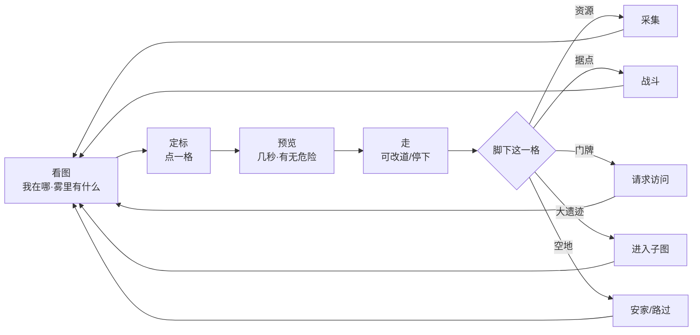

# 大地图行动为主 · 总体设计（完整作品）

> **定位**：以「走过去、站住、在这一格办事」为唯一主玩法入口的修仙大世界。
> 大地图不是导航器，**是舞台、是菜单、是世界本身**。
> **技术底稿**：`docs/大地图格子化设计方案.md`（格子/迷雾/移动/配置）
> **内容底稿**：`server/config/grid_config.json`、`server/config/grid_poi_data.json`
> **编写**：2026-09-23 · 第 7 轮定稿（行动模型 + 全玩法地点化）
> **状态**：**体验方向与铁律已定案**；落地按文末路线执行

---

## 〇、一页定调

### 0.1 一句话

> **我因为站在这里，所以能做这件事；因为要走过去，所以世界才大。**

### 0.2 六条铁律（高于一切局部规则）

| # | 铁律 | 含义 | 若违反会怎样 |
|---|------|------|-------------|
| **L1** | **地图常驻主舞台** | 打开游戏即在图上；顶栏永远回答「我在哪」 | 玩家进入「菜单游戏」，世界感归零 |
| **L2** | **行动必在场** | 一切**改变世界或消耗次数**的动作，必须发生在**正确的格子**上 | 侧栏一键修仙，地图被架空 |
| **L3** | **只有脚下能出手** | 采/建/进/访/战 仅对当前格（§格子方案 4.2.1） | 远程操作毁掉位置意义 |
| **L4** | **走路要花时间** | 耗时 = 格距 × 1 秒；远方是真远方 | 瞬移让世界缩成一张纸 |
| **L5** | **记忆会过期** | 迷雾 RTS + 快照冻结；背后的世界继续变 | 一次点亮全图，探索即结束 |
| **L6** | **路过不骚扰** | 途经他人门牌/触发点不自动弹交互 | 赶路被弹窗撕碎 |

> **L2 是本轮新增的总闸**（你确认的方向）。L1–L6 任一条被实现「绕过」，都算作品未完成。

### 0.3 三种操作，严格分流

| 类型 | 定义 | 要不要地点 | 例 |
|------|------|-----------|-----|
| **A · 世界行动** | 改变世界 / 花次数 / 产生不可逆结果 | **必须在对的格子**（L2） | 采集、建造、进入、访问、切磋、突破、闭关、买卖、接悬赏 |
| **B · 随身查看** | 只读自己的状态与藏品 | 不要地点，可侧抽屉 | 看属性、翻背包、读功法、看灵兽图鉴 |
| **C · 壳与社交** | 非世界系统 | 不走地图 | 设置、公告、聊天、GM |

**判定句**：这件事如果「人不在现场也能做」，那它就不该是大地图玩法，要么改成 B，要么删掉「一键」入口。

---

## 一、玩家的一天（体验脚本）

### 1.1 开场 60 秒

1. 落地在**越国出生带** `(0,7)`——图已亮开一小圈，其余是雾。
2. HUD：`越国·天南 › 越国平原 › (0,7) · 视野 R=3`。
3. 左操作板只显示脚下：「空地 · 可安家」。
4. 三点钟方向迷雾边缘露出**坊市图标**——不需要任务列表，眼睛会带你走。
5. 点坊市 → 路径预览 `途经 4 格 · 约 4 秒` → 启程 → 走到 → 左板出「进入坊市」→ 买卖发生在这里。

### 1.2 分钟级循环



### 1.3 日级循环

- **出洞**（洞府格）→ 跑一条资源线 / 遗迹线（路径预览串起来）
- 路上看见**新的门牌 / 废墟 / 聚落**→ 更新私人标记
- **回坊市**出货、修装、接悬赏
- **回洞**闭关（世界行动，必须躺在洞府里）
- 睡前：地图是唯一主界面，看一眼记忆里的旧路是否还通

### 1.4 验收句（上线后玩家应说得出）

1. 「我神识高，所以看得远。」
2. 「我常出门，所以认路。」
3. 「背后的世界会变，旧路值得重走。」
4. 「邻居是真邻居，洞府在图上那格。」
5. **「想做什么，就得先走到那儿。」** ← 本作品总验收

---

## 二、世界模型（引用底稿，只补行动语义）

| 概念 | 行动语义 |
|------|----------|
| **Region** | 一张「可站在上面」的舞台；进出靠门/传送/子区域入口 |
| **Cell** | 唯一行动位：脚下一格 = 当前可用的全部世界交互 |
| **三态迷雾** | VISIBLE=可出手；KNOWN=只可规划路径，不可出手；UNKNOWN=只能当可通行估 |
| **坐标** | 连续坐标做表现，**格坐标做玩法**（HUD 与操作板只读格坐标） |
| **建筑/门牌** | 改变「这一格能做什么」，不改变通行 |

**子区域不是副本 APP**：进苍坤旧禁 = 走进 `(3,10)` 再**进入**，舞台换成另一张网格，主界面结构不变（还是图 + 脚下板 + 壳）。

---

## 三、地点化行动总表（L2 落地 · 全玩法）

### 3.1 场所类型（决定左板按钮）

| 场所 key | 名称 | 何处出现 | 解锁的行动（A 类） |
|----------|------|----------|-------------------|
| `wild` | 荒野脚下 | 任意 empty/resource/monster… | 采集、拾取、扎营（预留）、钉标记 |
| `lair` | 据点 | `monster_nest` | 挑战、显影探查 |
| `hollow` | 小遗迹 | `ruin_small` | 探索一次 |
| `gate` | 大遗迹门 | `ruin_large` | 进入子区域 |
| `home` | 洞府门牌 | `cave_player` / 自己建筑 | 进入洞府、经营、**闭关/突破**、访客 |
| `market` | 坊市 | `town` | 买卖、典当、炼制委托、接悬赏、聚落小市 |
| `sect` | 山门 | `sect` | 宗门任务、贡献兑换、宗门战集结 |
| `port` | 传送/渡口 | `portal` | 使用传送（主动确认） |
| `ruin_exit` | 子区域出口 | 子区出口格 | 返回父区域 |
| `camp` | 世界事件点 | 事件改写格 | 参与事件（兽潮讨伐、商队、遗迹出世） |

### 3.2 系统 → 落点（对照现有 48 入口）

> 「入口」列是**唯一合法入口**。坞/搜索只能当**书签**——点了是把镜头移到该地点或提示「你须先到某处」，**不得**直接打开世界行动。

| 现有入口 | 类型 | 落点场所 | 场外点击时 | 备注 |
|----------|------|----------|-----------|------|
| 修炼/闭关/突破 | **A** | `home` 洞府格 | 提示「回洞府再闭关」+ 可一键导航回府 | 防止侧栏挂机修仙 |
| 洞府/药园 | **A** | `home` | 导航回家 | 经营改变世界 |
| 历练 | **A** | 当前 `wild`/POI 脚下 | 不可场外开 | 与旧次数制脱钩，改为「脚下事件」 |
| 采集/资源 | **A** | `resource` 脚下 | 无入口 | L3 |
| 副本·苍坤/虚天/昆吾/黄龙 | **A** | 对应 `gate` 脚下 | 书签导航到门 | 门是图上 POI |
| 多人副本/血色/坠魔/掩月/端午 | **A** | 指定集结 `gate`/`camp` | 书签导航 | 禁止全局招募按钮直接开战 |
| 世界 BOSS / 兽潮 | **A** | 事件格 `camp` | 导航到战场 | 图上高亮 |
| 坊市/拍卖/典当 | **A** | `market` 脚下 | 「去最近坊市」导航 | |
| 股市 | B+C | 随身（凡人商路也可） | 直接开 | 无强地点幻想，不硬造 |
| 炼制 | **A** | `market` 或 `home` | 导航 | 工坊在家或坊市 |
| 寻仙机缘 | **A** | `market` 或 `home` | 导航 | 摊/静室 |
| 宗门/太一门/宗门战 | **A** | `sect` 脚下 | 导航回山门 | |
| 悬赏 | **A** | `market` 接 / 荒野交 | 接取在坊市 | 交付看榜文 |
| 斗法/封神台/神识对决 | **A** | `market` 武台或双方同格 | 同格切磋走 §13.5 | 排位可报名为 `market` |
| 洞府社交/留言板 | **A** | 他人 `home` 或己 `home` | 导航 | |
| 道侣/双修 | **A** | 同格 或 双方 `home` | 「发出同格邀请」 | 不做菜单双修 |
| 侍妾远航 | **A** | `home` 或 `port` | 导航 | 远航=出行 |
| 储物袋/属性/功法书/法宝/器灵/阵法/傀儡/灵兽图鉴 | **B** | 随身抽屉 | 直接开 | 只读/整理 |
| 灵兽出战/放养 | **A** | `home` 灵兽苑 或 荒野放养格 | 导航 | 放养是占格 |
| 元婴出窍/第二元神/小世界/飞升 | **A** | `home` 静室 或 特定 `gate` | 导航 | 大事必在场 |
| 灵溪垂钓 | **A** | 水域 `resource`/专用格 | 导航到水边 | |
| 赌石 | **A** | `market` 石摊 | 导航 | |
| 道侣侍妾列表/设置/公告/聊天 | C | — | 直接开 | |

### 3.3 左板按钮生成规则（配置驱动）

```
脚下的 cell_type + 你是否 owner + 状态机
    → 场所 key
    → actions[]（来自 grid_poi / grid_config.actions_by_place）
    → 只渲染 1 个主按钮 + ≤3 次按钮
```

禁止代码里 `if (panel === 'market')` 开弹窗；**点「去坊市」= 导航到格，到了左板才出现「进入坊市」**。

### 3.4 导航书签（侧坞唯一合法职责）

侧坞对 A 类系统只有三件事：

1. **我在哪有这个**（地图高亮已知相关格，用 KNOWN/实况）
2. **带我去**（路径预览 + 启程，与点格子同一套）
3. **到了叫我**（到达后左板主按钮脉冲高亮）

**不得**在书签上直接 `openPanel('market')` 触发买卖。

---

## 四、行动与状态机

### 4.1 全局状态（互斥）

```
idle ⇄ moving ⇄ (on_arrive) idle
idle → in_cell_action（采集读条/探索/探查）
idle → in_building（进入洞府/坊市/子区域的「内景」）
idle → in_combat
idle → cultivating（仅 home）
banned / dead 为终端遮罩
```

| 状态 | 地图 | 左板 | 坞 |
|------|------|------|-----|
| idle | 可点终点 | 脚下行动 | 书签/B 类 |
| moving | 路径高亮，可改道/停下 | 只读 + 「停下」 | B 类可开 |
| in_cell_action | 锁操作 | 进度 + 取消（若有代价） | 只读 |
| in_building | 上层盖「内景」，背后仍是你那格 | 内景操作 | 内景内导航 |
| in_combat | 战斗 UI，败退回到入格前一格 | — | 禁 |
| cultivating | 图可看不可点 | 离开需先出定 | B 类可开 |

### 4.2 移动（行动的主旋律）

1. 点目标格（须 VISIBLE 或 KNOWN）→ 左板「路径预览」
2. 确认 → `moving`，按 1 格/秒结算
3. 途中 **L6**：不自动 `on_enter`
4. 强制事件（路径级）打断；主动「停下」合法
5. 到达 → 才执行脚下 `on_enter` / 刷新左板

### 4.3 脚下 `on_enter` 语义（到达才触发）

| cell_type | 到达时 |
|-----------|--------|
| empty | 左板「空地」；掷空格轻事件 |
| resource | 左板「采集」主按钮 |
| monster_nest | **强制进战**（L3/L6 例外：这是事件不是路过） |
| ruin_small | 左板「探索」 |
| ruin_large | 左板「进入」 |
| cave_player | 左板「叩门」（不自动请求） |
| town/sect | 左板「进入坊市/山门」 |
| portal | 左板「启用传送」（不自动） |
| barrier | 到不了（寻路绕开） |

---

## 五、主舞台 UI（L1）

结构、HUD、手势与迁移见技术稿 **§9.0**。此处只定**行动向**的三条：

1. **HUD 位置信息不可省**（面包屑 + 格坐标），任何断点都在。
2. **左板永远服务脚下**——它是 L2/L3 的 UI 形状。
3. **侧坞打开不得遮住地图**（宽屏）；关闭面板回来的是地图，不是日志。

选中格（青）与脚下格（金）分离；路径预览画在**图上**，不在弹窗向导里。

---

## 六、内景（进屋之后）

进入 `home` / `market` / `sect` / 子区域后的「内景」规则：

| 规则 | 说明 |
|------|------|
| 来去同格 | 内景关闭 = 回到刚才那格，不瞬移到别处 |
| 内景不是第二游戏 | 主屏仍是「空间感」布局：左情境、中内景内容、右册页 |
| 世界时间不停 | 闭关/赶路他人仍在图上行动；记忆规则不因内景关闭 |
| 子区域 | 整舞台换成子网格（仍 L1–L6），出口格回父图 |

洞府内部可以继续用现有 `player_caves` 虚拟空间——**门牌在格子上，屋内仍是那一套**（零迁移）。

---

## 七、成长如何兑换成「走得更远」

| 养成 | 兑换 |
|------|------|
| 神识属性 | 视野 R（看更远、发现 hidden） |
| 境界 | 区域门槛、安全区、能否穿过危险 zone |
| 灵力/丹药 | 显影探查、长途（预留） |
| 装备/功法 | 聚落、标记、地方志集齐给 `sense_bonus` |
| 洞府 | 家 = 复活/闭关锚点 = 社交坐标 |

**禁止**把成长做成「解锁侧栏按钮」——成长应解锁**图上的可达性与可见性**。

---

## 八、与旧玩法的迁移原则

1. **先改入口，不改内容表**：丹药、装备、副本剧本尽量保 ID，只改「从哪进」。
2. **能书签化的先书签化**，第二步再压成纯地点。
3. **双入口期间**以地图入口为准，坞入口降级为导航。
4. **删掉的**：全局「一键采集/一键闭关/一键进本」类聚合面板（违反 L2）。
5. **保留的**：随身 B 类抽屉、聊天、设置、GM。

---

## 九、内容如何为「行动」服务

（详细表见格子稿 §15，此处只定原则）

- 每个 `town/sect/ruin_large` 必须让人**远远认得出来**（LOD 图标 + 地方志）。
- 路上的轻内容（空格事件、行旅偶遇）**不弹系统框**，进左板/日志一行字。
- 危险必须**在预览里标红**，让「绕不绕」成为玩家的选择。
- 聚落、废墟、坐化遗府都是**图上的真相**，不是通知栏红点。

---

## 十、阶段路线（作品级）

| 阶段 | 交付 | 过检 |
|------|------|------|
| **W0 铁律与契约** | 本稿 + 格子稿交叉引用；A/B/C 分流表签字 | 需求评审过 |
| **W1 主舞台壳** | HUD + 常驻地图 + 脚下左板（先假数据） | 打开即图，能看见坐标 |
| **W2 走与到** | 格子生成、点终点、路径预览、1 格/秒 | 能走 20 格并到达触发 |
| **W3 脚下行动** | 采/战/进/建 配置化 on_enter | L3 探针：隔格操作必拒 |
| **W4 地点化入口** | 全表 A 类改导航书签；坞禁止直开 | 抽测 20 个入口 0 旁路 |
| **W5 洞府闭环** | home 闭关/突破/访客/坐化遗府 | 「不在府不能闭关」 |
| **W6 纵深** | 显影、世界事件、标记游记、聚落小市 | 核心循环满 30 分钟可玩 |

---

## 十一、作品验收清单

| # | 判据 |
|---|------|
| V1 | 新会话 < 3s 看到地图与自己坐标 |
| V2 | 任选 20 个世界行动，全部需要站在正确格 |
| V3 | 侧坞对 A 类只有「高亮/导航」，无直开交易或闭关 |
| V4 | 赶路 10 格无强制弹窗；到格才有脚下板 |
| V5 | 关闭任意面板后主视野仍是地图 |
| V6 | 离开再回来，KNOWN 格呈记忆态且不自动变实况 |
| V7 | 玩家可复述 0.1 一句话与验收句第 5 条 |

---

## 十二、决策存档（本作品）

| # | 结论 |
|---|------|
| P1 | **L2 世界行动必在场**；B 类随身查看；C 类壳 |
| P2 | 侧坞 = 导航书签，不是玩法总闸 |
| P3 | 修炼/买卖/进本等大事全部地点化 |
| P4 | 主舞台 HUD/左板/地图 分工见格子稿 §9.0 |
| P5 | 股市等无地点幻想系统留 B+C，不硬造格子 |
| P6 | 内景关闭回到原格，禁止屋内瞬移 |

---

*本稿是体验与行动模型的唯一事实来源；格与配置细节以 `大地图格子化设计方案.md` 与 `grid_*.json` 为准。冲突时：**铁律 L1–L6 > 本表 > 技术实现细节**。*
