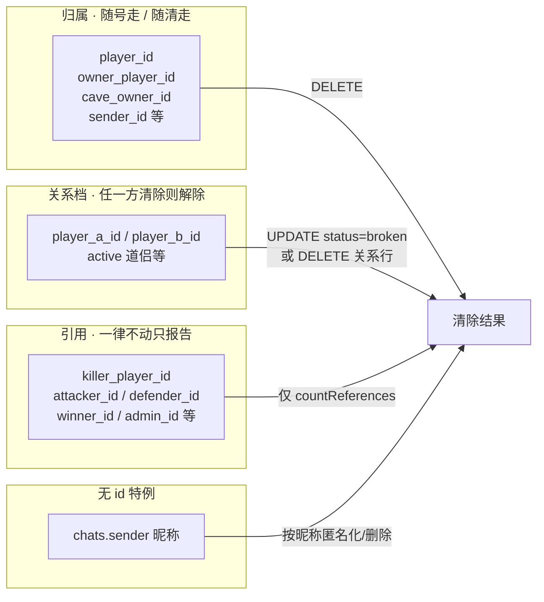
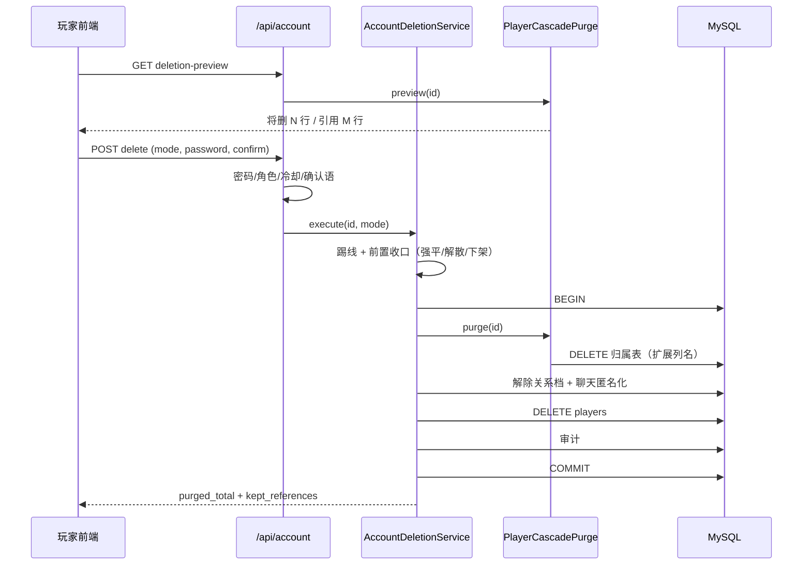

# 用户数据删除接口设计

> 目标：玩家自助 / GM 代操作的「清除该用户全部相关数据」能力；**含未来新增功能的数据**；账号本身可选 **保留** 或 **清除**。
>
> 本文是接口与数据边界设计，不写具体实现代码。落地时以本文为准。

---

## 1. 目标与非目标

### 1.1 目标

| # | 要求 | 设计对应 |
|---|------|----------|
| 1 | 清除该用户所有相关数据 | 归属档全删（见 §4） |
| 2 | 含未来新增功能数据 | 表清单现查 `information_schema` + 列名约定，不写死表名（见 §5） |
| 3 | 账号可选保留或清除 | 两档 `account_mode`：`keep` / `delete`（见 §3） |
| 4 | 不破坏其他玩家的历史 | 引用档只报告、不删（见 §4.2） |

### 1.2 非目标

- 不做跨服 / 跨库迁移；只处理本库。
- 不做「导出个人数据」（可另开接口；本设计预留响应字段位）。
- 不改 `PlayerCascadePurge` 的「归属删、引用留」哲学，只补列名覆盖面与账号两档语义。

---

## 2. 现状盘点（可复用 / 缺口）

| 能力 | 位置 | 现状 | 本设计用法 |
|------|------|------|------------|
| 级联清归属行 | `game/persistence/PlayerCascadePurge.js` | 已实现；现查表清单；`preview`/`purge`/`deletePlayer` | **直接复用**，作清数据核心 |
| GM 删号 | `DELETE /api/admin/players/:id` | 已接级联，强制删账号 | 保留；改为可传 `account_mode`，默认 `delete` |
| GM 重置 | `POST /api/admin/reset-player` | 只重置 `players` 部分字段 + 可选清 `items`；**80+ 子表未动** | **废弃语义**，改走本接口 `account_mode=keep` |
| 前端「注销」 | `SettingsModal.vue` | 只清 localStorage、回登录页 | 文案与行为改接本接口（见 §8） |
| 级联列口径 | `OWNERSHIP_COLUMNS = [player_id, owner_player_id]` | 双人/对抗表列名盖不住（见 §2.1） | **必须扩**，否则「清干净」是假绿 |
| 聊天 | `chats.sender` 仅昵称字符串 | 无 `player_id`，级联扫不到 | 删除时按昵称清洗（§4.3）；长期建议补列 |

### 2.1 列名口径缺口（本设计必须先补的洞）

`PlayerCascadePurge` 只认两类名字：

- 归属：`player_id`、`owner_player_id`
- 引用：`/^[a-z_]+_player_id$/`（如 `killer_player_id`）

现网真实存在的玩家指向列里，下列**两档都不进**，`applyOwnership` 不会删、`countReferences` 也不报：

| 表 | 列 | 语义 | 应进哪一档 |
|----|-----|------|------------|
| `dao_companions` / `dao_companion` | `player_a_id` / `player_b_id` | 道侣关系（双方共有） | **关系档**（§4.1）：任一方清除则解除关系 |
| `pvp_battle_records` | `attacker_id` / `defender_id` / `winner_id` | 对战历史 | 引用（对方的战报） |
| `player_divine_duel` | `challenger_id` / `defender_id` / `winner_id` | 神识对决 | 引用 |
| `dao_companion_protect_logs` | `attacker_id` / `defender_id` | 护道日志 | 引用 |
| `chat_red_packets` | `sender_id` | 红包发出 | 归属（未领完的要退/拆，见 §4.4） |
| `chat_red_packet_claims` | `receiver_id` | 领取记录 | 归属（我领的）；`sender` 侧历史留 |
| `auctions` | `seller_id` / `current_bidder_id` / `winner_id` | 拍卖 | 挂单归属删；成交/出价历史按引用留 |
| `cave_messages` / `cave_visitor` / `cave_treasure_log` | `cave_owner_id` | 洞府社交 | 归属（这是洞府主人的墙） |
| `admin_logs` | `admin_id` | 审计 | 引用（必须活过被删的号） |
| `chats` | `sender`（昵称） | 世界/私聊 | 无 id，只能按昵称（§4.3） |

**结论：** 在扩列名之前，接口响应里写「已清除 N 行」会对道侣、PVP、拍卖、红包、洞府留言大面积漏删。这是 P0。

---

## 3. 账号两档语义（`account_mode`）

| | `keep` 保留账号 | `delete` 清除账号 |
|--|----------------|-------------------|
| 登录凭证 | 保留 `username` / `password` | 整行删除，账号名可被重新注册 |
| `players.id` | **保留**（引用档里的 id 指向不断） | 删除 |
| `role` | 保留（admin 号两档都拒绝自助删） | 同左 |
| QQ 绑定 `player_oauth_bindings` | **保留**（属登录身份，不属玩法数据） | 删除（归属档） |
| 玩法数据（境界/背包/灵石/子表…） | 全清 + 按 `role_init` 重开新号初值 | 全清 |
| 隐私字段 `ip_address` / `device_info` | 置 null | 随行删除 |
| 昵称 `nickname` | 保留（可选参数 `new_nickname` 换名） | 随行删除，可被重新占用 |
| Token | `token_version += 1`（全端强制重登） | Token 立即失效（行没了） |
| 适用场景 | 「重开一局 / 清档重来」 | 「删号 / 隐私清除」 |

### 3.1 为什么 `keep` 保留 `players.id`

现网大量表用数字 id 记「谁打了谁」。若 `keep` 重建行会换新 id，则：

- 引用档里指向旧 id 的行变成永久孤儿；
- 或被迫把引用也改写/删除 —— 那是在替别人改历史。

**保留 id + 清空玩法字段** 与 `PlayerCascadePurge` 的「引用原样留着」口径一致。

### 3.2 `keep` 与「新号初值」的单一口径

重开字段一律走 `PlayerService.initializePlayer` 同源配置（`role_init`），并经 `PlayerService.initialAttributeBlob` 过滤，避免 GM `reset-player` 那套「半截重置 + 旧管线残骸键」再出现一次。

**不要** 在路由里手写一份字段清单；清单 = `initializePlayer` 写入的键 ∪ 状态机复位键（闭关/悟道/瓶颈/出窍/副本/阵法/死亡等）。落地时抽 `PlayerService.buildFreshPlayerState({ username, password, nickname })`，注册与 `keep` 删除共用。

---

## 4. 数据清删边界

沿用 `PlayerCascadePurge` 两档哲学，扩成 **三档 + 一条无 id 特例**。



### 4.1 三档口径

| 档 | 判据（列名） | 动作 | 未来新表如何进档 |
|----|--------------|------|------------------|
| **归属** | `player_id`、`owner_player_id`、`owner_id`、`user_id`、`cave_owner_id`、`sender_id`、`receiver_id`、`seller_id`…（见下方正则） | `DELETE WHERE col = :id` | 新表用约定列名即自动进档 |
| **关系** | `player_a_id`、`player_b_id`、`challenger_id`+`defender_id` 成对语义中的「进行中状态行」 | 进行中的关系 **解除/解散**；已结束的历史进引用档 | 新双人表把「进行中状态」与「历史记录」拆开，或列名进关系清单 |
| **引用** | `*_player_id` 且非归属名、`attacker_id`/`defender_id`/`winner_id`/`admin_id`/`killer_id` 等 | **不删**；`countReferences` 报出 | 新表用 `xxx_player_id` 或引用名清单 |

**归属列扩展正则（替换现在的写死两列）：**

```text
归属候选：
  ^(player_id|owner_player_id|owner_id|user_id|sender_id|receiver_id|seller_id|cave_owner_id)$
  | _owner_id$
  | ^(player)_[ab]_id$          ← 仅当整行走「关系档」时

引用候选：
  _player_id$
  | ^(attacker_id|defender_id|winner_id|loser_id|killer_id|admin_id|challenger_id)$
  | _id$ 且列注释/表归属标记为「历史记录」（可选，二期）
```

落地约束（与现网 `PlayerCascadePurge` 同级的硬闸）：

1. **空清单必须抛**，禁止把「一张表都没清」报成成功。
2. **引用档永远不进 DELETE**，第二道 `classify` 闸保留。
3. 新增归属名 / 引用名进 `OWNERSHIP_COLUMNS` / `REFERENCE_COLUMNS` 常量时，测试用合成清单钉住分档结果（同 `PlayerCascadePurge.test.js` 风格）。

### 4.2 引用档为什么坚持不删

`pvp_battle_records` 一行是 A 打了 B 的共同历史。A 注销时删掉整行 = 替 B 抹掉「我赢过/输过谁」。现网 GM 删号已是这个口径，自助删除不得更激进（否则会出现「对手一删号，我的战绩蒸发」）。

响应里必须带 `kept_references`，前端文案写清：

> 为保留其他道友的历史记录，与你相关的对战/留言引用将保留 id 痕迹，但不再关联到你的账号名下任何玩法数据。

若法务要求「引用也必须匿名化」，升级路径是 **引用档脱敏**（把 id 保留、把旁路昵称快照列抹掉），而不是物理 DELETE —— 不在本期。

### 4.3 聊天（无 player_id 特例）

`chats` 只有 `sender` 昵称。删除流程：

1. `account_mode=delete`：`DELETE FROM chats WHERE sender = :nickname`（世界频道建议改为 **匿名化** `sender='已注销道友'`、`content='（消息已撤回）'`，避免打穿别人的上下文；由配置 `account_delete.chat_mode = anonymize|delete` 切换，默认 `anonymize`）。
2. `account_mode=keep`：同上，按 **当前** 昵称洗；若传了 `new_nickname`，先洗聊天再改名。
3. 红包：`chat_red_packets.sender_id = :id` 且未领完 → 先退款/拆包（调用红包服务的结算），再删归属行。

**长期建议（不阻塞本期）：** `chats` 增加可空 `sender_player_id` 并回填；之后聊天进归属档，本特例删除。可在模型注释里登记一条待办。

### 4.4 进行中事务的前置阻断

删除是「整条链一起走」的，但玩家可能正卡在半中间状态。**清数据前**先做前置检查 / 强制收口：

| 状态 | 来源 | 处理 |
|------|------|------|
| 在线 | Socket `onlineUsers` | 先 `notifyPlayerUpdate(id, 'account_wipe')` 并踢线，再删 |
| 进行中战斗 | `active_battles` | 归属档直接删（或先 `CombatService` 投降结算，推荐直接删：清档语义盖过战报） |
| 多人副本进行中 | `multi_dungeon_instance` + 成员 | 若是队长且实例未结束 → 强制解散（复用 GM `force-dissolve`）；成员则只删自己的成员行 |
| 道侣 `status=accepted` | `dao_companions` | 解除关系（通知对方） |
| 拍卖进行中挂单 | `auctions` / `market_listings` / `pawnshop_listings` | 下架并回收押金/寄售物（归属删前先结算，禁止直接删导致对方钱货两空） |
| 股市持仓/融资 | `stock_holdings` / `stock_margin_account` | 强制平仓 + 债清（复用强平逻辑）；否则 `keep` 重开后会继承负债 |
| 洞府展品/留言 | 归属档 | 直接删；留言是归属（墙是主人的） |

前置收口失败（例如强平回滚）→ **整笔删除事务回滚**，返回 409 + 失败原因，绝不「删一半」。

---

## 5. 未来新增功能如何被自动覆盖

这是需求硬点。机制三层，**不靠人记得改删除接口**：

| 层 | 机制 | 覆盖什么 | 失效时 |
|----|------|----------|--------|
| L1 约定列名 | 新表玩家指向列命名进归属/引用正则 | 绝大多数 `player_id` 玩法表 | 无感覆盖 |
| L2 信息架构现查 | 每次删除前 `information_schema` 现查（可短缓存） | 不改代码也能看见新表 | 空清单抛错 |
| L3 静态闸测试 | 扫描 `models/*.js` 里所有 `*_id` 列名，断言「每个玩家指向列都进了某一档」 | 列名不符合约定的 **新模型** 在 CI 就红 | 挡住漏网之鱼 |

L3 是补 L1 约定被人忘掉的情况：新增 `models/foo.js` 里出现 `user_id` / `uid` / `openid` 这类既非归属正则也非引用正则的列，测试直接失败并点名文件，逼开发者在常量表里登记分档（带理由，同 `OWNERSHIP_DENY` 风格）。

```text
# 伪判据（tests/PlayerColumnCoverage.test.js）
for each model field name ending with _id / id semantics:
    assert classify(name) in {ownership, relation, reference, deny_with_reason}
```

**运维约定（写进 server/README 或本节）：**

> 新增玩法表时，玩家指向列优先叫 `player_id`（归属）或 `xxx_player_id`（引用）。双人进行中状态用 `player_a_id`/`player_b_id` 并进关系档。做不到就去 `PlayerCascadePurge` 的分档常量登记，CI 会拦。

---

## 6. 接口定义

### 6.1 玩家自助

挂在 `routes/player.js`（或新建 `routes/account.js`，推荐新建，和「改资料」分开）。

#### `GET /api/account/deletion-preview`

预览将清除的内容（只读，`PlayerCascadePurge.preview`）。

**权限：** JWT（本人）

**Query：** 无（身份来自 token）

**响应 200：**

```json
{
  "code": 200,
  "data": {
    "account_mode_options": ["keep", "delete"],
    "preview": {
      "tables": [{ "table": "player_items", "column": "player_id", "rows": 42 }],
      "total": 925,
      "references": [{ "table": "pvp_battle_records", "column": "attacker_id", "rows": 12, "needs_decision": true }]
    },
    "notes": [
      "引用档（他人历史）不会删除，仅解除与你的玩法关联",
      "聊天记录将匿名化",
      "进行中的道侣/挂单/持仓会先收口"
    ]
  }
}
```

#### `POST /api/account/delete`

执行清除。

**权限：** JWT（本人）  
**限流：** `authLimiter` 或更严（如 1 次 / 24h / 账号）  
**Body：**

```json
{
  "account_mode": "keep | delete",
  "confirm_phrase": "删除账号 | 清空数据",
  "password": "当前密码（两档都要求）",
  "new_nickname": "可选，仅 keep；不传则保留原道号",
  "reason": "可选，≤200 字，进审计"
}
```

**校验（顺序固定，失败即 400/401/409，不发 DELETE）：**

1. `account_mode ∈ {keep, delete}`，`confirm_phrase` 与模式精确匹配（防误触）。
2. `bcrypt.compare(password, player.password)` 失败 → 401。
3. `role === 'admin'` → 403（自助不能删管理员；GM 通道另说）。
4. 前置收口检查（§4.4）有阻断项 → 409 + `blocking_issues[]`。
5. 冷却：距上次成功删除 < 24h → 429（防脚本连打）。

**事务内（同生同死）：**

```
BEGIN
  // A. 前置收口（强平/解散/下架/退红包）——可独立小事务，失败则外层不开始
  // B. 归属档 purge（扩展列名后）
  // C. 关系档解除
  // D. 聊天匿名化
  // E. account_mode == keep:
  //      重建 players 玩法字段（buildFreshPlayerState）
  //      清 ip_address / device_info
  //      nickname = new_nickname ?? old
  //      token_version += 1
  //    account_mode == delete:
  //      DELETE FROM players WHERE id = :id
  // F. 审计：admin_logs 或独立 account_ops（见 §6.3）
COMMIT
```

**响应 200：**

```json
{
  "code": 200,
  "message": "数据已清除",
  "data": {
    "account_mode": "keep",
    "purged_total": 925,
    "purged_tables": [{ "table": "player_items", "column": "player_id", "rows": 42 }],
    "kept_references": [{ "table": "pvp_battle_records", "column": "attacker_id", "rows": 12 }],
    "settled": {
      "auctions_off": 1,
      "dissolved_dao_companion": true,
      "stock_liquidated": 0
    },
    "player_id": 123,
    "relogin_required": true
  }
}
```

`account_mode=delete` 时 `player_id` 仍返回（给前端展示回执），但账号已不存在。

#### `POST /api/account/delete/cancel`（可选，二期）

若采用冷静期（§7.2），用此撤销申请。本期默认 **立即执行**，接口不先做。

---

### 6.2 GM 通道（改造现有）

| 接口 | 改造 |
|------|------|
| `DELETE /api/admin/players/:id` | Body/query 增加 `account_mode`（默认 `delete`，兼容旧调用）；内部改调与自助同一 `AccountDeletionService` |
| `POST /api/admin/reset-player` | **标记 deprecated**；实现改为 `account_mode=keep` 的别名（含子表级联），避免两套重置口径 |

GM 额外规则：

- 可删 `admin` 号，但要求 Body 再传 `allow_admin: true`（现网 `includeAdmin` 同语义），并写进 `admin_logs`。
- 响应结构与自助一致，便于后台展示「清了多少 / 留了哪些引用」。

---

### 6.3 审计与回执

| 项 | 设计 |
|----|------|
| 审计落点 | `admin_logs`：`action = 'account_wipe' \| 'account_delete'`，`admin_id` = 操作者（自助时为自己）；`details` 存 mode / purged_total / kept_references 摘要 / reason |
| 玩家回执 | 响应体即回执；可选写一条站内信（`keep` 可见，`delete` 无处可送） |
| 冷却记录 | 内存或 `admin_logs` 查询「该 id 最近一次 account_*」即可，不必新表 |

---

## 7. 流程与一致性

### 7.1 时序（`account_mode=delete`）



### 7.2 立即删 vs 冷静期

| 方案 | 优点 | 缺点 |
|------|------|------|
| **A. 立即执行（本期默认）** | 实现简单；符合游戏「清档重来」直觉 | 误触无法反悔（靠密码 + 确认语兜住） |
| B. 申请后 7 天冷静期 | 合规友好、可撤销 | 要新表 `account_deletion_requests` + 定时任务 + 期间只读状态 |

**建议本期 A。** 若后续有合规要求，加冷静期时只需在 `AccountDeletionService.execute` 前插一层「申请/到期调度」，事务体不变。

---

## 8. 前端配合（最小集）

| 位置 | 改动 |
|------|------|
| `SettingsModal.vue` 「重新开始游戏 (注销)」 | 拆成两个入口：**清空数据重开**（`keep`）与 **注销账号**（`delete`） |
| 确认弹窗 | 必须输入密码 + 输入确认短语；展示 `deletion-preview` 的表格摘要与 `kept_references` 说明 |
| 成功后 | `keep`：强制 `logout` + 重登（token_version 已变）；`delete`：清本地缓存回登录页 |

文案示例（delete）：

> 将删除账号 **「道号」** 及其全部玩法数据（含后续版本新增数据）。  
> 为保留其他道友的历史，对战等引用记录会保留 id 痕迹。  
> 此操作不可撤销。请输入密码，并输入「删除账号」以确认。

---

## 9. 安全与风控

| 风险 | 对策 |
|------|------|
| 盗号后恶意删号 | 必须密码二次验证；建议再加「改密后 24h 内禁止 delete」 |
| CSRF / 误触 | 自定义 `confirm_phrase`；仅 POST + JWT；同源前端 |
| 管理员误删 | 自助 403；GM 通道对 `role=admin` 要 `allow_admin` |
| 脚本刷删 | 冷却 24h；`authLimiter` |
| SQL 注入 | 延续 `assertPlayerId` + 列名来自 `information_schema` + 反引号；禁止拼接用户字符串进 SQL |
| 半截删除 | 单事务；前置收口失败整笔回滚 |
| 删完假绿 | 空清单抛错；L3 静态闸；探针 `smoke_account_deletion.js` 在隔离库量「删后归属行 = 0」 |

---

## 10. 与现有代码的关系

```text
                    AccountDeletionService（新建）
                    ├── preview()
                    ├── execute(id, { account_mode, ... })
                    └── settleInFlight()   ← 强平/解散/下架/退红包
                              │
                              ▼
                    PlayerCascadePurge（扩展列名分档）
                    ├── purge / preview / countReferences
                    └── OWNERSHIP_*/RELATION_*/REFERENCE_*
                              │
              ┌───────────────┼────────────────┐
              ▼               ▼                ▼
     POST /api/account/delete   DELETE /api/admin/players/:id
                                POST /api/admin/reset-player (→ keep 别名)
```

| 文件 | 动作 |
|------|------|
| `game/persistence/PlayerCascadePurge.js` | 扩三档列名；`purge` 支持 `skipTables`（`keep` 时跳过 `player_oauth_bindings`） |
| `game/core/PlayerService.js` | 抽 `buildFreshPlayerState`（注册 / keep 共用） |
| `game/services/AccountDeletionService.js` | **新建**，编排收口 + 级联 + 两档账号处置 |
| `routes/account.js` | **新建**，`GET preview` + `POST delete` |
| `routes/admin.js` | 删号/reset 接到 Service |
| `index.js` | `app.use('/api/account', ...)` |
| `tests/PlayerColumnCoverage.test.js` | **新建** L3 静态闸 |
| `tests/AccountDeletion.test.js` | **新建** 两档语义 / 确认语 / admin 拒绝 |
| `scripts/smoke_account_deletion.js` | **新建** 隔离库真删探针 |
| `client/.../SettingsModal.vue` | 双入口 + 密码/确认语 |

---

## 11. 已拍板决策（2026-09-23）

| # | 问题 | 决定 |
|---|------|------|
| 1 | 聊天记录 | **保留原文**（不匿名化、不物理删） |
| 2 | 删除时机 | **立即执行**（密码 + 确认短语双闸；无冷静期） |
| 3 | `keep` 道号 / QQ | **可选改名**（`new_nickname`）+ **保留 QQ 绑定** |
| 4 | 引用档旁路昵称 | 本期不脱敏 |
| 5 | 删号冷却 | `authLimiter`（登录档限流）+ 确认短语；无独立 24h 冷却表 |

---

## 12. 验收标准

1. **两档语义：** `keep` 后能用原账号密码登录且角色为初始凡人；`delete` 后同 username 可重新注册。
2. **未来覆盖：** 隔离库 `CREATE TABLE t_new (player_id ...)` 后不改删除代码，探针能清掉该表行；`CREATE TABLE t_odd (uid ...)` 未登记则 L3 测试红。
3. **引用保留：** 删 A 后，B 的 `pvp_battle_records` 里 A 参与的行仍在，`kept_references` 非空且行数对得上。
4. **关系解除：** 删 A 后 B 的道侣状态变为解除/空，B 收到通知。
5. **无半截：** 前置收口失败时，原数据一行不少。
6. **审计：** `admin_logs` 可查到 mode / purged_total / reason。
7. **旧口径收敛：** 仓库内不再有「只重置 players 不清子表」的删除/重置调用（静态闸或人工清单清零）。
